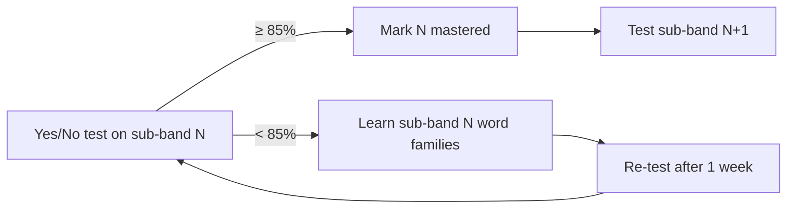

# DET 120

Personal project to learn English and reach an overall score of **120** on the
Duolingo English Test (DET). 120 is the first **C1** score.

## Goal

| Item | Target |
|------|--------|
| DET overall | **120** (10–160 scale, steps of 5) |
| CEFR | C1 |
| ≈ IELTS / TOEFL | 7.0 / 95+ |
| Vocabulary | ~5,000–6,500 word families + Academic Word List |
| Target test date | **2027-03-03** (not booked; set 2026-09-16, issue #7, baseline in [vocab/progress.md](vocab/progress.md)) |

## The test in one table

The DET is one ~1-hour **adaptive** test. Tasks are mixed, not in sections,
but every task measures one or two of four skills.

| Skill | Task types |
|-------|-----------|
| Reading | Read and Complete, Read and Select, Interactive Reading |
| Listening | Listen and Select, Listen and Type, Interactive Listening |
| Writing | Write About the Photo, Read Then Write, Interactive Writing, Writing Sample, Interactive Listening summary |
| Speaking | Read Aloud, Speak About the Photo, Read Then Speak, Listen Then Speak, Speaking Sample |

Subscores: **Literacy** (R+W), **Comprehension** (R+L), **Conversation** (L+S),
**Production** (W+S). Full details and the timings: [docs/det-format.md](docs/det-format.md)
(since July 2025 *Interactive Speaking* replaces *Listen Then Speak* and
*Read Aloud* is gone; the drills below keep both as practice).

## Vocabulary is the foundation

Vocabulary drives the fast, frequent DET tasks (Read/Listen and Select, Read and
Complete) and limits every other skill. Research on **coverage** (how many words
in real speech/text you already know):

| Word families known | Conversation | Written text |
|---------------------|--------------|--------------|
| 2,000 | ~93–95% | ~85% |
| 3,000 | ~95–96% | ~88–90% |
| 5,000 | ~97% | ~93–95% |
| 6,000–7,000 | **~98%** | ~96% |
| 8,000–9,000 | ~99% | **~98%** |

98% coverage is the point where you understand comfortably without a
dictionary. For DET 120 the target is **5,000–6,500 families + AWL**.

A **word family** = base word + its forms and derivations
(`decide → decides, decided, deciding, decision, decisive, indecisive`).
We learn the whole family on one card.

### Levels: 500-word sub-bands, not just A1–C2

Words are ranked by corpus frequency (Nation BNC/COCA) and cut into
**500-word sub-bands**. Each sub-band is small enough to test in 2 minutes
with a yes/no test (the same format as DET *Read and Select*).

| Sub-band | Rank | ≈ CEFR | ≈ DET |
|----------|------|--------|-------|
| 1K-a / 1K-b | 1–500 / 501–1000 | A1 | 10–30 |
| 2K-a / 2K-b | 1001–1500 / 1501–2000 | A2–B1 | 35–55 |
| 3K-a / 3K-b | 2001–2500 / 2501–3000 | B1 | 60–85 |
| 4K-a / 4K-b | 3001–3500 / 3501–4000 | B2 | 90–105 |
| 5K-a / 5K-b | 4001–4500 / 4501–5000 | B2+ | 105–115 |
| **6K-a / 6K-b** | 5001–5500 / 5501–6000 | **C1** | **120+** |

`vocab/subbands.csv` is the source of truth for these cuts. Coxhead AWL families
(563 of 570 sit inside Nation 1–6K) are flagged `awl=1` rather than kept as a
separate sub-band.

Extra per-word difficulty numbers are stored so the lists can be re-cut later:

| Column | Scale | Source |
|--------|-------|--------|
| `rank` | 1 … 25,000 | Nation BNC/COCA |
| `zipf` | 1.0–7.0 (log frequency) | SUBTLEX-US |
| `prevalence` | 0–100% of natives who know it | Brysbaert 2019 |
| `cefr` | A1–C1 | Oxford 3000/5000 |
| `gse` | 10–90 (C1 = 76–84) | Pearson GSE, where available |

**Rule:** ≥85% on a sub-band's yes/no test = mastered → start the next one.
Your vocabulary level is the highest mastered sub-band.

## Test your level

A small local web app runs the yes/no test as a computerised adaptive test
(issues #4, #14): every word has a difficulty `b` on a continuous 0–12 band
scale (`1k-a` = 0–1 … `6k-b` = 11–12), you have an ability `θ` on the same
scale, and each block is 10 real words drawn from `|b − θ| ≤ 1` plus 5
invented words. Every answer updates `θ` (Rasch model, expected-a-posteriori);
the next block is drawn around the new `θ`; the test stops once `θ` is known
to ± 0.35, after 6 blocks, or when the bank runs dry — usually 30–60 words,
2–4 minutes. The **level** is the sub-band where you know 85 % of the words
(`θ − 1.16`), the **frontier** the sub-band containing `θ`, and the DET
estimate is read off `vocab/subbands.csv`. Formulas, anchors and the
differences to the real DET: [docs/det-adaptive.md](docs/det-adaptive.md).

```bash
python3 -m venv .venv && .venv/bin/pip install -r requirements.txt
.venv/bin/uvicorn app.main:app          # then open http://localhost:8000
.venv/bin/python -m pytest -q           # simulated learners for every sub-band
```

The app is one page with a header on every screen (issue #18): **Practise**
is the home — your level, the *Today* card of the schedule, the nine drills as
cards, the level test at the end — and **Words** is the study list. Every screen has a hash (`#home`, `#learn`,
`#test`, `#result`, `#drill/<task>`), so the browser's Back and Forward move
between screens and a link can open any of them; Escape leaves Words or a
drill for the home page.

Keys: `Y` = real word, `N` = not a word, `Space` = next block. The result
page shows the level, `θ ± se`, the frontier, the estimated DET score with its
range, the path (`θ` after each block), the block scores pooled per sub-band
(`hits/10 − false alarms/5`, the old block view), a guessing check
(false-alarm rate > 25 % → unreliable) and the words you missed, each with a
*Pin* button that keeps it on the study list (see *my-words* below).
Everything is saved as you go, nothing to click: `vocab/tests/` holds
`levels.csv` (one row per test, with `theta` and `se`), `results.csv` (per
block), `misses.csv` (every word you got wrong, with the answer time) and
`sessions/*.json` (every item with its `b`). An unfinished test is offered as
*Resume* the next time you open the app. Schemas: [vocab/tests/README.md](vocab/tests/README.md).

**Re-test after one week** (issue #8): once a reliable test is on file the
start page says *Re-test `4k-a` due in 3 days* (or *due today* / *overdue by
2 days*) — 7 days after the last reliable test, in the current frontier
sub-band. Every new test starts from the last reliable `θ` as its prior (the
CAT's way of starting at the frontier; 6.0, the middle of the scale, before
the first test), so the *Re-test* button and *Start test* do the same thing.
Words shown in the last 30 days are not drawn again. An unreliable test
neither moves the date nor becomes the prior.

## The schedule

Twenty minutes a day, six days a week, five sub-band gates to 2027-03-03
(issue #19): words 10 min, then one drill 10 min — dictation and cloze on
alternate days, the level test on Saturday, Sunday off. The home page's
*Today* card shows the two rows with their ticks, the streak, the next gate
and the projected test date; a gate week that ends unpassed slides every later
gate and the date by a week. `vocab/plan.csv` holds the gates
(`scripts/plan.py init --start <Monday>`), `vocab/plan-log.csv` the *Words
done* ticks, and `scripts/plan.py` prints where the plan stands. The rules,
the gate table and the worked example: [docs/schedule.md](docs/schedule.md).

## What to learn

*Words* in the header (also *What to learn next* on the result page, or
`http://localhost:8000/#learn`)
reads the whole history and turns it into a study list (issue #6):

- **Frontier** = the sub-band containing your ability `θ` (from the last
  reliable test): the words you know about half of, the next ones to master.
  The **level** is the sub-band containing `θ − 1.16`, where you know 85 %.
  The pooled block scores per sub-band (each test weighing half as much as
  the one after it) stay on the page as a second view.
- **Word status**, from every time a word was shown: `repeat` (missed twice,
  still wrong), `missed`, `learned` (missed, then right — left out until
  missed again), `shaky` (right but slower than 2× that test's median),
  `known`.
- **Study list order:** repeat → my-words → misses from the frontier
  sub-band → other misses, newest first → shaky → the rest of the frontier
  sub-band by rank. Each entry shows the family forms, definition, example
  and synonyms.
- **my-words** (issue #8) = words met in real use, `vocab/my-words.csv`
  (`date, family, source, note, done`): a miss you *Pin* on the result page
  (`source=test`), the *Add a word* box on the Learn page (`source=learn`,
  with a note — meaning or the sentence you met it in), or a Phase 5 drill
  error (`source` = the task id). One open row per family; a word outside
  `vocab/index.csv` is kept as an *extra* word with the note as its
  definition. A test miss is not copied automatically — `misses.csv` already
  has it; pinning is for a miss you want to keep even after the next test
  marks it `learned`.
- **Export to Anki** writes the batch to `vocab/decks/<date>.txt` and marks
  the my-words entries in it `done`, so they drop off the list. Every deck
  is one note per family for the `DET family` note type with **two cards**:
  *Recognise* (word → forms, definition, example, synonyms — *Read and
  Select*) and *Recall* (definition + the example with the word blanked out,
  or a first-letter hint, and a typing box — *Read and Complete*, *Listen
  and Type*). Set the note type up once from [docs/anki.md](docs/anki.md).
- **Whole sub-band and my-words decks** come from the same code on the
  command line: `python3 scripts/export_anki.py 4k-a` → `vocab/decks/4k-a.txt`
  (every family of the sub-band, tagged `4k-a new` / `missed` / …, re-import
  updates the notes), `--my-words` → `vocab/decks/my-words.txt`, `--batch 20`
  = the Learn button, `4k-a --check` = the families with no example that
  contains the word. Fix those, or simplify a definition, by hand in
  `vocab/overrides.csv` (`family, definition, example`): it is applied on top
  of `index.csv` when the app loads and never rewritten by a script.

Nothing is stored beyond the history and `my-words.csv`: the statuses are
recomputed from `vocab/tests/` every time.

## Track progress

One command turns the history in `vocab/tests/` into the generated half of
[vocab/progress.md](vocab/progress.md) (issue #9); run it after each test
and commit, so the level history is readable on GitHub without the app:

```bash
.venv/bin/python scripts/report.py            # rewrites vocab/progress.md, prints the Now line
.venv/bin/python scripts/report.py --print    # the generated Markdown on stdout, nothing written
.venv/bin/python scripts/report.py --anki ~/collection-copy.anki2   # + Anki review stats per sub-band
.venv/bin/python scripts/report.py --check    # exit 1 if levels.csv / results.csv disagree with the session JSON
.venv/bin/python scripts/report.py --sentences   # b_text histogram of the sentence bank per band (docs/sentences.md)
```

The generated block holds: the **Now** line (pooled level, CEFR and DET
range, frontier, trend, number of tests, and the last test's level when it
differs from the pooled one); a table with one row per sub-band — CEFR, DET
range, blocks, *% known* (recency-weighted hits/real), the pooled *score*
(known − false alarms, the number the 0.85 rule applies to) and status; the
word-status counts; and a Mermaid line chart of the level over test dates
(y = sub-band index, one point per day = that day's last reliable test with a
level). `--anki` adds a table of cards, mature cards, reviews in the last 7
days and lapses per sub-band from a *copy* of Anki's `collection.anki2`
(Anki locks the original while open; tags come from the exported decks).

Only the text between `<!-- generated:start -->` and `<!-- generated:end -->`
changes; everything above the markers (target date, outside vocabulary
estimates, the baseline rows) is hand-written and never touched. The same
numbers come back from `GET /api/progress`, and the *What to learn* page
draws the level chart once there are two or more points. The schedule
(`vocab/plan.csv`) is rendered into the same block as a *Plan* section — week,
streak, the gate table with any slide and the projected date — and mock DET
scores (`vocab/tests/mocks.csv`) as a *Mock tests* section — see *Weekly
cycle* below.

The invented words come from the British Lexicon Project (nonwords that native
speakers reject ≥ 95 % of the time), picked per sub-band so their lengths
mirror that sub-band's headwords: `vocab/pseudowords.csv`.

## Practise the tasks

Every DET task type as a timed drill in the same app (issue #10, Phase 5):
the *Practise* cards on the home page, or `#drill/<task>` — schemas and the
rules per drill in [practice/README.md](practice/README.md), the real clock
values in [docs/det-format.md](docs/det-format.md).

- **Which words come up**: every vocabulary drill draws from one **priority
  pool** (issue #13) — the words you missed in the level test (`repeat`,
  `missed`, `shaky`) and in practice (open `vocab/my-words.csv` rows) first,
  weighted 6 / 3 / 2 against 1 for a never-shown frontier word, with half
  the draws reserved for them while any are left; the item screen says why
  (`missed 2× in the test`, `my-words · listen-and-type 2026-09-14`), the
  practice page shows the pool's size, and a my-words row is closed by
  practice once its word was hit on two different days
  ([practice/README.md](practice/README.md) § *Which item comes next*).
- **Read and Complete** (`read-and-complete`): the DET's C-test on a
  50–80-word passage — every second eligible word after the first sentence
  loses its second half (`He ski____ a row in t__ text a__ so the sent____
  was incompre________`), 5 blanks, 3 minutes — drawn from a bank of 440
  Simple English Wikipedia passages (`practice/read-and-complete/passages/`,
  CC BY-SA, fetched and filtered by `scripts/passages.py`, reviewed by hand)
  whose `b_text` lies within ±0.6 of your θ, a passage that holds one of
  your priority words preferred and that word always among the blanks.
  `credit = correct ÷ blanks` moves θ; every blank is a `hit`, a `spelling`
  slip (one letter off) or a `vocabulary` miss for its family. *Sentence
  mode* (1 minute) cuts a `vocab/senses.csv` example of a pool family the
  same way. A passage is not shown twice in 30 days, a sentence in 7.
- **Fill in the Blanks** (`fill-in-the-blanks`): one sentence from the
  dictation bank near your θ, one word missing but for its first third
  (`te____` for *tenant*), 20 seconds, exact match — the DET item, not a
  C-test; the missing word is a priority word first. Credit 1 or 0 moves θ;
  the event is the word's `hit` / `spelling` / `vocabulary`.
- **Listen and Type** (`listen-and-type`): a 6–14-word sentence whose
  difficulty `b_text` ([docs/sentences.md](docs/sentences.md)) lies within
  ±0.6 of your θ (the frontier sub-band before the first test), read by an
  edge-tts neural voice (four accents; the MP3 is cached in
  `practice/listen-and-type/audio/`, so a sentence needs the internet once),
  at most 3 plays, 1 minute. Scored as partial credit by character-level
  edit distance, which moves the same θ as the level test; the word-level
  diff tags every wrong word with what went wrong — hearing, spelling, form
  or vocabulary — and only the vocabulary misses count against the word
  ([docs/det-adaptive.md](docs/det-adaptive.md) § *Dictation*).
- **Speaking** (`read-aloud`, `speak-photo`, `read-then-speak`,
  `listen-then-speak`): the prompt, photo (`practice/speaking/photos/`, your
  own) or spoken prompt, 20 s preparation, then the microphone records for
  up to 90 s (Read Aloud: 20 s, no preparation); the recording is kept as
  `practice/speaking/recordings/<attempt>.webm` and played back beside the
  prompt.
- **Writing** (`write-photo`, `read-then-write`, `interactive-writing`): the
  prompt, a live word count against the 50-word minimum, 1 or 5 (+ 3)
  minutes, autosave every 10 s to `practice/writing/drafts/<attempt>.md`;
  Interactive Writing's part 2 follows part 1 on the row's follow-up.
- After a speaking or writing drill: **rate yourself** on four 1–5 lines
  (task fulfilled, fluency, vocabulary, grammar) and list the **words you
  lacked** — each goes to `vocab/my-words.csv` with `source` = the task id
  and the prompt id as the note; a word outside the list becomes an *extra*
  entry. Wrong cloze blanks and dictation words go there by themselves, with
  the sentence as the note, so the study list and the Anki export
  (`<subband> my-words`) pick them up without another step.
- Every attempt is one row of `practice/attempts.csv` (`date, attempt, task,
  item, subband, seconds, timed_out, score, self, words, errors, file, theta,
  b, events`); the start page shows today's count per task. Routine: one
  speaking and one writing drill a day, cloze, fill-in and dictation three
  times a week.

```bash
.venv/bin/pip install -r requirements.txt   # adds edge-tts
.venv/bin/uvicorn app.main:app             # http://localhost:8000/#drill/read-and-complete
```

The prompts (`practice/{speaking,writing}/prompts.csv`, ~20 each, written in
the style of the public practice material) are the part to grow by hand;
the passage bank grows with `scripts/passages.py fetch` (the search terms in
`scripts/topics.txt`) plus a read-through of `passages/incoming/` before the
files are promoted; photos are your own files and stay out of git.



## Weekly cycle

Phase 6 (issue #11) ties the pieces above into one routine, which the
schedule of [docs/schedule.md](docs/schedule.md) fixes in the calendar:
Saturday level test → words and one drill a day → a full DET practice test
after each gate → Sunday off. The practice test is the one thing typed by hand: one row of
`vocab/tests/mocks.csv` (`date, source, overall, literacy, comprehension,
conversation, production, weakest, notes`; schema and the low-end rule in
[vocab/tests/README.md](vocab/tests/README.md)). The free practice test gives
only a range and no subscores, so record the **low end** as `overall`, leave
the subscores blank, fill `weakest` from the self-review and put the range in
`notes`. `scripts/report.py` then renders a *Mock tests* section into
[vocab/progress.md](vocab/progress.md) — a chart of `overall` against the
120 line, a table of the rows (the lowest subscore marked `←`, `official`
rows in bold, the vocabulary level of the day beside each) and three lines
that make the Sunday review a five-minute read, by three fixed rules:

- **Trend:** `overall` of the last two test dates → `up` / `down` / `flat`;
  `mock overdue` is appended when no row is dated within the last 14 days.
- **Focus next week:** the lowest subscore of the latest row that has all
  four, if that row is at most 28 days old (tie → the one that dropped most
  since the previous row with subscores, then Literacy → Comprehension →
  Conversation → Production); otherwise the `weakest` column of the latest
  row; otherwise vocabulary, the frontier sub-band. The line names the drill
  folders — Literacy = `read-and-complete/`, `writing/`; Comprehension =
  `read-and-complete/`, `listen-and-type/`, `interactive/`; Conversation =
  `listen-and-type/`, `speaking/`; Production = `writing/`, `speaking/` —
  and next week gets one extra timed drill a day from them.
- **Booking:** on the practice rows (`det-practice` and third-party mocks;
  one value per date, the lowest when two sources share a day):
  **Book the real test** when the last two dates are ≥ 120; `one more ≥ 120
  to book` when only the last one is; otherwise `keep going` with the gap to
  120. Any `official` row ≥ 120 is **Goal reached**.

A same-day retake replaces the earlier row of the same source, and a
malformed row (score not a multiple of 5, out of 10–160, bad date, unknown
`weakest`) stops the report with its line number — nothing is skipped
silently. The same numbers come back under `mocks` in `GET /api/progress`.

## Repository layout (planned)

```
DET/
├── README.md
├── docs/
│   ├── det-format.md            # test structure and scoring
│   ├── sentences.md             # where drill sentences come from; a sentence's band is its target word's, its difficulty b_text is computed
│   ├── det-adaptive.md          # the θ / b scale: item difficulty, Rasch + EAP, level, frontier, DET anchors
│   ├── anki.md                  # the "DET family" note type: fields, both card templates, import steps
│   ├── schedule.md              # 20 min a day, five sub-band gates, the slide rule, the Today card (issue #19)
│   └── implementation-phases.md # build plan for this repo
├── data/
│   ├── raw/                     # Nation word lists + SOURCES.md (URL, date, licence)
│   ├── extract/                 # slim TSV extracts the build reads (regenerated, not committed)
│   └── AUDIT.md                 # data audit: coverage, gradient, mirror check
├── vocab/
│   ├── index.csv                # one row per word family: sub-band, rank, zipf, cefr, members, definition …
│   ├── subbands.csv             # cut table: rank range, CEFR label, DET range per sub-band
│   ├── senses.csv               # dictionary: up to 3 senses per family (definition, example) from Open English WordNet
│   ├── relations.csv            # synonym / antonym / similar links between families
│   ├── pseudowords.csv          # invented words for the yes/no test (British Lexicon Project)
│   ├── my-words.csv             # words met in practice: date, family, source, note, done
│   ├── overrides.csv            # hand-simplified definition / example per family; never written by a script
│   ├── decks/                   # Anki exports (Learn page, scripts/export_anki.py): one note, two cards per family
│   ├── tests/                   # level-test history: levels.csv, results.csv, misses.csv, sessions/*.json; mocks.csv (hand-typed)
│   ├── plan.csv                 # the schedule's gates: subband, week, due (scripts/plan.py init); plan-log.csv = the Words-done ticks
│   └── progress.md              # hand-written baseline above the markers; scripts/report.py rewrites the block between them
├── app/                         # level-test app: FastAPI backend + static/index.html
├── tests/                       # pytest: simulated learners, API round-trip
├── design/                      # UI design canvases (artboard sources)
├── practice/                    # task drills (issue #10): attempts.csv, read-and-complete/ (passages/ — the 440-passage bank, #17 — and the cloze cache), listen-and-type/ (sentence + audio cache), speaking/ (prompts, photos, recordings), writing/ (prompts, drafts), interactive/README.md
└── scripts/                     # fetch_raw.sh, extract_raw.py, build_bands.py, build_dict.py, build_pseudowords.py, audit_data.py, export_anki.py, report.py, plan.py, passages.py (+ topics.txt, its search terms)
```

See [docs/implementation-phases.md](docs/implementation-phases.md) for the
build order.
