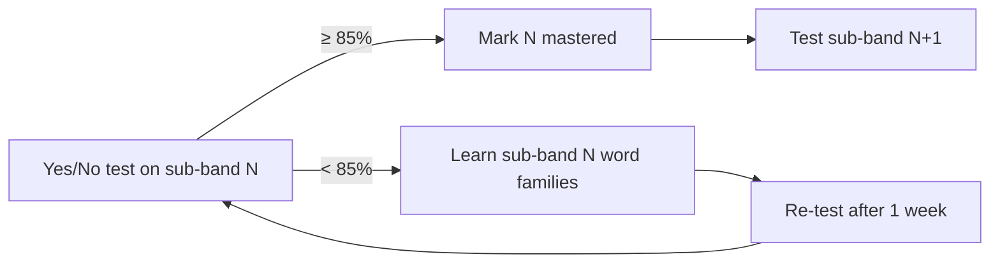

# DET 120

Personal project to learn English and reach an overall score of **120** on the
Duolingo English Test (DET). 120 is the first **C1** score.

## Goal

| Item | Target |
|------|--------|
| DET overall | **120** (10–160 scale, steps of 5) |
| CEFR | C1 |
| ≈ IELTS / TOEFL | 7.0 / 95+ |
| Vocabulary | ~5,000–6,500 word families + Academic Word List |

## The test in one table

The DET is one ~1-hour **adaptive** test. Tasks are mixed, not in sections,
but every task measures one or two of four skills.

| Skill | Task types |
|-------|-----------|
| Reading | Read and Complete, Read and Select, Interactive Reading |
| Listening | Listen and Select, Listen and Type, Interactive Listening |
| Writing | Write About the Photo, Read Then Write, Interactive Writing, Writing Sample, Interactive Listening summary |
| Speaking | Read Aloud, Speak About the Photo, Read Then Speak, Listen Then Speak, Speaking Sample |

Subscores: **Literacy** (R+W), **Comprehension** (R+L), **Conversation** (L+S),
**Production** (W+S). Full details: [docs/det-format.md](docs/det-format.md).

## Vocabulary is the foundation

Vocabulary drives the fast, frequent DET tasks (Read/Listen and Select, Read and
Complete) and limits every other skill. Research on **coverage** (how many words
in real speech/text you already know):

| Word families known | Conversation | Written text |
|---------------------|--------------|--------------|
| 2,000 | ~93–95% | ~85% |
| 3,000 | ~95–96% | ~88–90% |
| 5,000 | ~97% | ~93–95% |
| 6,000–7,000 | **~98%** | ~96% |
| 8,000–9,000 | ~99% | **~98%** |

98% coverage is the point where you understand comfortably without a
dictionary. For DET 120 the target is **5,000–6,500 families + AWL**.

A **word family** = base word + its forms and derivations
(`decide → decides, decided, deciding, decision, decisive, indecisive`).
We learn the whole family on one card.

### Levels: 500-word sub-bands, not just A1–C2

Words are ranked by corpus frequency (Nation BNC/COCA) and cut into
**500-word sub-bands**. Each sub-band is small enough to test in 2 minutes
with a yes/no test (the same format as DET *Read and Select*).

| Sub-band | Rank | ≈ CEFR | ≈ DET |
|----------|------|--------|-------|
| 1K-a / 1K-b | 1–500 / 501–1000 | A1 | 10–30 |
| 2K-a / 2K-b | 1001–1500 / 1501–2000 | A2–B1 | 35–55 |
| 3K-a / 3K-b | 2001–2500 / 2501–3000 | B1 | 60–85 |
| 4K-a / 4K-b | 3001–3500 / 3501–4000 | B2 | 90–105 |
| 5K-a / 5K-b | 4001–4500 / 4501–5000 | B2+ | 105–115 |
| **6K-a / 6K-b** | 5001–5500 / 5501–6000 | **C1** | **120+** |

`vocab/subbands.csv` is the source of truth for these cuts. Coxhead AWL families
(563 of 570 sit inside Nation 1–6K) are flagged `awl=1` rather than kept as a
separate sub-band.

Extra per-word difficulty numbers are stored so the lists can be re-cut later:

| Column | Scale | Source |
|--------|-------|--------|
| `rank` | 1 … 25,000 | Nation BNC/COCA |
| `zipf` | 1.0–7.0 (log frequency) | SUBTLEX-US |
| `prevalence` | 0–100% of natives who know it | Brysbaert 2019 |
| `cefr` | A1–C1 | Oxford 3000/5000 |
| `gse` | 10–90 (C1 = 76–84) | Pearson GSE, where available |

**Rule:** ≥85% on a sub-band's yes/no test = mastered → start the next one.
Your vocabulary level is the highest mastered sub-band.



## Repository layout (planned)

```
DET/
├── README.md
├── docs/
│   ├── det-format.md            # test structure and scoring
│   └── implementation-phases.md # build plan for this repo
├── data/
│   ├── raw/                     # Nation word lists + SOURCES.md (URL, date, licence)
│   ├── extract/                 # slim TSV extracts the build reads (regenerated, not committed)
│   └── AUDIT.md                 # data audit: coverage, gradient, mirror check
├── vocab/
│   ├── index.csv                # one row per word family: sub-band, rank, zipf, cefr, members …
│   ├── subbands.csv             # cut table: rank range, CEFR label, DET range per sub-band
│   ├── my-words.csv             # words met in practice
│   ├── decks/                   # Anki exports (one card per family)
│   ├── tests/                   # generated yes/no tests + results
│   └── progress.md              # % known per sub-band → estimated level
├── practice/                    # per-task drills (speaking, writing, dictation)
└── scripts/                     # fetch_raw.sh, extract_raw.py, build_bands.py, audit_data.py
```

See [docs/implementation-phases.md](docs/implementation-phases.md) for the
build order.
