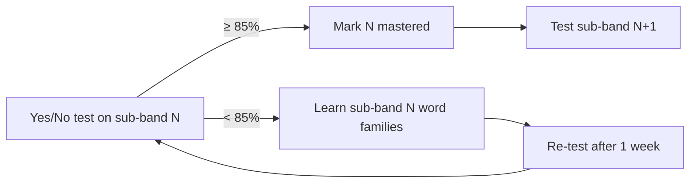

# DET 120

Personal project to learn English and reach an overall score of **120** on the
Duolingo English Test (DET). 120 is the first **C1** score.

## Goal

| Item | Target |
|------|--------|
| DET overall | **120** (10–160 scale, steps of 5) |
| CEFR | C1 |
| ≈ IELTS / TOEFL | 7.0 / 95+ |
| Vocabulary | ~5,000–6,500 word families + Academic Word List |
| Target test date | **2027-03-03** (not booked; set 2026-09-16, issue #7, baseline in [vocab/progress.md](vocab/progress.md)) |

## The test in one table

The DET is one ~1-hour **adaptive** test. Tasks are mixed, not in sections,
but every task measures one or two of four skills.

| Skill | Task types |
|-------|-----------|
| Reading | Read and Complete, Read and Select, Interactive Reading |
| Listening | Listen and Select, Listen and Type, Interactive Listening |
| Writing | Write About the Photo, Read Then Write, Interactive Writing, Writing Sample, Interactive Listening summary |
| Speaking | Read Aloud, Speak About the Photo, Read Then Speak, Listen Then Speak, Speaking Sample |

Subscores: **Literacy** (R+W), **Comprehension** (R+L), **Conversation** (L+S),
**Production** (W+S). Full details: [docs/det-format.md](docs/det-format.md).

## Vocabulary is the foundation

Vocabulary drives the fast, frequent DET tasks (Read/Listen and Select, Read and
Complete) and limits every other skill. Research on **coverage** (how many words
in real speech/text you already know):

| Word families known | Conversation | Written text |
|---------------------|--------------|--------------|
| 2,000 | ~93–95% | ~85% |
| 3,000 | ~95–96% | ~88–90% |
| 5,000 | ~97% | ~93–95% |
| 6,000–7,000 | **~98%** | ~96% |
| 8,000–9,000 | ~99% | **~98%** |

98% coverage is the point where you understand comfortably without a
dictionary. For DET 120 the target is **5,000–6,500 families + AWL**.

A **word family** = base word + its forms and derivations
(`decide → decides, decided, deciding, decision, decisive, indecisive`).
We learn the whole family on one card.

### Levels: 500-word sub-bands, not just A1–C2

Words are ranked by corpus frequency (Nation BNC/COCA) and cut into
**500-word sub-bands**. Each sub-band is small enough to test in 2 minutes
with a yes/no test (the same format as DET *Read and Select*).

| Sub-band | Rank | ≈ CEFR | ≈ DET |
|----------|------|--------|-------|
| 1K-a / 1K-b | 1–500 / 501–1000 | A1 | 10–30 |
| 2K-a / 2K-b | 1001–1500 / 1501–2000 | A2–B1 | 35–55 |
| 3K-a / 3K-b | 2001–2500 / 2501–3000 | B1 | 60–85 |
| 4K-a / 4K-b | 3001–3500 / 3501–4000 | B2 | 90–105 |
| 5K-a / 5K-b | 4001–4500 / 4501–5000 | B2+ | 105–115 |
| **6K-a / 6K-b** | 5001–5500 / 5501–6000 | **C1** | **120+** |

`vocab/subbands.csv` is the source of truth for these cuts. Coxhead AWL families
(563 of 570 sit inside Nation 1–6K) are flagged `awl=1` rather than kept as a
separate sub-band.

Extra per-word difficulty numbers are stored so the lists can be re-cut later:

| Column | Scale | Source |
|--------|-------|--------|
| `rank` | 1 … 25,000 | Nation BNC/COCA |
| `zipf` | 1.0–7.0 (log frequency) | SUBTLEX-US |
| `prevalence` | 0–100% of natives who know it | Brysbaert 2019 |
| `cefr` | A1–C1 | Oxford 3000/5000 |
| `gse` | 10–90 (C1 = 76–84) | Pearson GSE, where available |

**Rule:** ≥85% on a sub-band's yes/no test = mastered → start the next one.
Your vocabulary level is the highest mastered sub-band.

## Test your level

A small local web app runs the yes/no test adaptively (issue #4): it starts at
`4k-a`, shows 10 real words + 5 invented words per block, moves up a sub-band
when the corrected score (`hits/10 − false alarms/5`) is ≥ 0.85 and down
otherwise, and stops on the second direction change or after 6 blocks —
45–90 words, 3–6 minutes.

```bash
python3 -m venv .venv && .venv/bin/pip install -r requirements.txt
.venv/bin/uvicorn app.main:app          # then open http://localhost:8000
.venv/bin/python -m pytest -q           # simulated learners for every sub-band
```

Keys: `Y` = real word, `N` = not a word, `Space` = next block. The result
page shows the level, the estimated DET range, the pooled score per sub-band,
a guessing check (false-alarm rate > 25 % → unreliable) and the words you
missed, each with a *Pin* button that keeps it on the study list (see
*my-words* below). Everything is saved as you go, nothing to click:
`vocab/tests/` holds `levels.csv` (one row per test), `results.csv` (per
block), `misses.csv` (every word you got wrong, with the answer time) and
`sessions/*.json` (every item). An unfinished test is offered as *Resume*
the next time you open the app. Schemas: [vocab/tests/README.md](vocab/tests/README.md).

**Re-test after one week** (issue #8): once a reliable test is on file the
start page says *Re-test `4k-a` due in 3 days* (or *due today* / *overdue by
2 days*) — 7 days after the last reliable test, in the current frontier
sub-band — and a *Re-test `4k-a`* button starts the staircase there instead
of at `4k-a`'s default middle. Only the starting block changes: the walk,
stop rules and level are the same. An unreliable test neither moves the date
nor starts the clock.

## What to learn

*What to learn* (start page, result page, or `http://localhost:8000/#learn`)
reads the whole history and turns it into a study list (issue #6):

- **Frontier** = the next sub-band to master: the lowest sub-band you were
  tested on and failed, at or just above your level. Scores are pooled over
  reliable tests, each test weighing half as much as the one after it.
- **Word status**, from every time a word was shown: `repeat` (missed twice,
  still wrong), `missed`, `learned` (missed, then right — left out until
  missed again), `shaky` (right but slower than 2× that test's median),
  `known`.
- **Study list order:** repeat → my-words → misses from the frontier
  sub-band → other misses, newest first → shaky → the rest of the frontier
  sub-band by rank. Each entry shows the family forms, definition, example
  and synonyms.
- **my-words** (issue #8) = words met in real use, `vocab/my-words.csv`
  (`date, family, source, note, done`): a miss you *Pin* on the result page
  (`source=test`), the *Add a word* box on the Learn page (`source=learn`,
  with a note — meaning or the sentence you met it in), or a Phase 5 drill
  error (`source` = the task id). One open row per family; a word outside
  `vocab/index.csv` is kept as an *extra* word with the note as its
  definition. A test miss is not copied automatically — `misses.csv` already
  has it; pinning is for a miss you want to keep even after the next test
  marks it `learned`.
- **Export to Anki** writes the batch to `vocab/decks/<date>.txt` and marks
  the my-words entries in it `done`, so they drop off the list. Every deck
  is one note per family for the `DET family` note type with **two cards**:
  *Recognise* (word → forms, definition, example, synonyms — *Read and
  Select*) and *Recall* (definition + the example with the word blanked out,
  or a first-letter hint, and a typing box — *Read and Complete*, *Listen
  and Type*). Set the note type up once from [docs/anki.md](docs/anki.md).
- **Whole sub-band and my-words decks** come from the same code on the
  command line: `python3 scripts/export_anki.py 4k-a` → `vocab/decks/4k-a.txt`
  (every family of the sub-band, tagged `4k-a new` / `missed` / …, re-import
  updates the notes), `--my-words` → `vocab/decks/my-words.txt`, `--batch 20`
  = the Learn button, `4k-a --check` = the families with no example that
  contains the word. Fix those, or simplify a definition, by hand in
  `vocab/overrides.csv` (`family, definition, example`): it is applied on top
  of `index.csv` when the app loads and never rewritten by a script.

Nothing is stored beyond the history and `my-words.csv`: the statuses are
recomputed from `vocab/tests/` every time.

## Track progress

One command turns the history in `vocab/tests/` into the generated half of
[vocab/progress.md](vocab/progress.md) (issue #9); run it after each test
and commit, so the level history is readable on GitHub without the app:

```bash
.venv/bin/python scripts/report.py            # rewrites vocab/progress.md, prints the Now line
.venv/bin/python scripts/report.py --print    # the generated Markdown on stdout, nothing written
.venv/bin/python scripts/report.py --anki ~/collection-copy.anki2   # + Anki review stats per sub-band
.venv/bin/python scripts/report.py --check    # exit 1 if levels.csv / results.csv disagree with the session JSON
```

The generated block holds: the **Now** line (pooled level, CEFR and DET
range, frontier, trend, number of tests, and the last test's level when it
differs from the pooled one); a table with one row per sub-band — CEFR, DET
range, blocks, *% known* (recency-weighted hits/real), the pooled *score*
(known − false alarms, the number the 0.85 rule applies to) and status; the
word-status counts; and a Mermaid line chart of the level over test dates
(y = sub-band index, one point per day = that day's last reliable test with a
level). `--anki` adds a table of cards, mature cards, reviews in the last 7
days and lapses per sub-band from a *copy* of Anki's `collection.anki2`
(Anki locks the original while open; tags come from the exported decks).

Only the text between `<!-- generated:start -->` and `<!-- generated:end -->`
changes; everything above the markers (target date, outside vocabulary
estimates, the baseline rows) is hand-written and never touched. The same
numbers come back from `GET /api/progress`, and the *What to learn* page
draws the level chart once there are two or more points. Mock DET scores
(`vocab/tests/mocks.csv`) are rendered by Phase 6 (issue #11).

The invented words come from the British Lexicon Project (nonwords that native
speakers reject ≥ 95 % of the time), picked per sub-band so their lengths
mirror that sub-band's headwords: `vocab/pseudowords.csv`.



## Repository layout (planned)

```
DET/
├── README.md
├── docs/
│   ├── det-format.md            # test structure and scoring
│   ├── anki.md                  # the "DET family" note type: fields, both card templates, import steps
│   └── implementation-phases.md # build plan for this repo
├── data/
│   ├── raw/                     # Nation word lists + SOURCES.md (URL, date, licence)
│   ├── extract/                 # slim TSV extracts the build reads (regenerated, not committed)
│   └── AUDIT.md                 # data audit: coverage, gradient, mirror check
├── vocab/
│   ├── index.csv                # one row per word family: sub-band, rank, zipf, cefr, members, definition …
│   ├── subbands.csv             # cut table: rank range, CEFR label, DET range per sub-band
│   ├── senses.csv               # dictionary: up to 3 senses per family (definition, example) from Open English WordNet
│   ├── relations.csv            # synonym / antonym / similar links between families
│   ├── pseudowords.csv          # invented words for the yes/no test (British Lexicon Project)
│   ├── my-words.csv             # words met in practice: date, family, source, note, done
│   ├── overrides.csv            # hand-simplified definition / example per family; never written by a script
│   ├── decks/                   # Anki exports (Learn page, scripts/export_anki.py): one note, two cards per family
│   ├── tests/                   # level-test history: levels.csv, results.csv, misses.csv, sessions/*.json; mocks.csv (hand-typed)
│   └── progress.md              # hand-written baseline above the markers; scripts/report.py rewrites the block between them
├── app/                         # level-test app: FastAPI backend + static/index.html
├── tests/                       # pytest: simulated learners, API round-trip
├── design/                      # UI design canvases (artboard sources)
├── practice/                    # per-task drills (speaking, writing, dictation)
└── scripts/                     # fetch_raw.sh, extract_raw.py, build_bands.py, build_dict.py, build_pseudowords.py, audit_data.py, export_anki.py, report.py
```

See [docs/implementation-phases.md](docs/implementation-phases.md) for the
build order.
