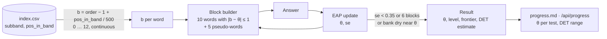
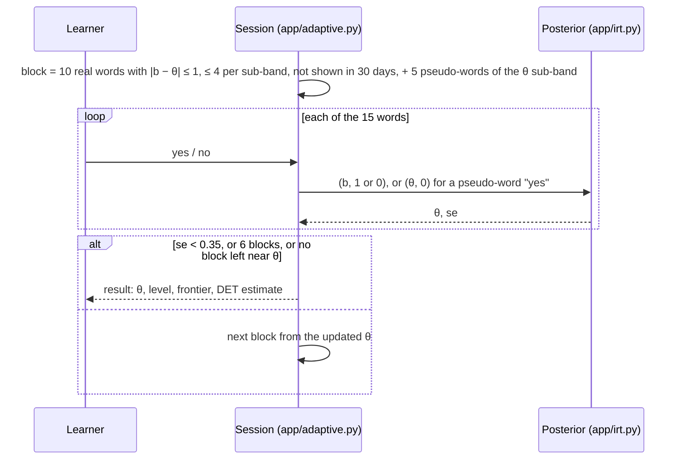

# One scale for words and learners: θ, b and the level test as a CAT

The DET puts every item and every test-taker on **one scale**: an item has a
difficulty `b`, a person an ability `θ`, `P(correct) = f(θ − b)`, and the next
item is the one whose `b` is closest to the current `θ` (Settles, LaFlair &
Hagiwara 2020; the DET Technical Manual). This page records how that scale is
built here (issue #14), what the level test does with it, how a result is
turned into a level and a DET estimate, and where it differs from the real
thing. The code is `app/irt.py` (the scale, ~150 lines of `math`),
`app/adaptive.py` (the test) and `app/learn.py` (`theta_history()`, the
replay of saved sessions).



## Item difficulty `b`

Every family in `vocab/index.csv` gets

```
b = (order − 1) + pos_in_band / 500          # order = the sub-band's row in vocab/subbands.csv, 1 … 12
```

so `b` is the **continuous band index**: `1k-a` covers `0 < b ≤ 1`, `1k-b`
`1 < b ≤ 2`, …, `6k-b` `11 < b ≤ 12`. The last word of `1k-a` (`pos_in_band`
500) has `b = 1.0`, the first of `1k-b` has `b = 1.002`: monotone in rank,
continuous across the band edges. `pos_in_band` orders the words inside a
sub-band by Zipf frequency, so `b` follows frequency inside each 500-word cut
as well as between cuts; `irt.scale_rank(order, pos_in_band)` is the word's
position 1 … 6000 on this scale (the `rank` column of `index.csv` is Nation's
own rank and is not used). Rank is the main feature of the DET's
word-difficulty model, and it is what the bands already encode; `zipf`,
`prevalence` and `cefr` stay in `index.csv` for a later refit. An optional
`b_adjust` column (default 0, absent today) is added to `b` when responses
refit an item (#15 does that for sentences and passages: `textdiff.refit()`,
[sentences.md](sentences.md) § How difficulty is computed).

A pseudo-word has no `b`.

## The model

Rasch with one discrimination for the whole bank:

```
P(θ, b) = 1 / (1 + exp(−A · (θ − b)))        A = 1.5 per band
```

| θ − b | P(correct) | reading |
|---|---|---|
| −1 | 0.18 | a word one band above θ |
| 0 | 0.50 | the frontier: the sub-band containing θ |
| +1 | 0.82 | a word one band below θ |
| **+1.156** | **0.85** | the old block rule's mastery line: `MASTERY_GAP = ln(0.85 / 0.15) / A` |
| +2 | 0.95 | |

`A = 1.5` was chosen so that "one band below θ" means "known about four times
in five", which is what the 500-word cuts were meant to express, and so that
the mastery line of the old rule (block score ≥ 0.85) has a place on the new
scale.

## Ability `θ`

**Expected a posteriori** on a grid, `θ = 0, 0.05, …, 13`, with a normal prior
`N(θ₀, 1.5²)`:

```
posterior(θ) ∝ prior(θ) · Π_i  P(θ, b_i)^s_i · (1 − P(θ, b_i))^(1 − s_i)
θ̂  = E[θ | responses]           se = sd[θ | responses]
```

- A response is `(b, s)` with `s = 1` for a right answer and `0` for a wrong
  one. A fraction `0 < s < 1` is allowed and enters as `P^s · (1 − P)^(1 − s)`
  — the partial-credit form that the dictation (#16) and cloze (#17) drills
  use; `s = 0.5` on an item at `b = θ` leaves `θ` where it is.
- **Pseudo-words**: a *yes* on an invented word enters as a wrong answer at
  `b = θ` (the `θ` of that moment). It lowers `θ` and widens `se`. A *no* is
  not evidence and changes nothing. The reliability rule is unchanged: a
  false-alarm rate above 25 % flags the session unreliable, and an unreliable
  session never becomes the next prior.
- **Prior `θ₀`** = the `θ` of the last reliable session (6.0, the middle of
  the scale, before the first one). This is the CAT's version of "start at the
  frontier": the *Start* and *Re-test* buttons both do it. `POST
  /api/session?start=<sub-band>` puts `θ₀` in the middle of a named sub-band
  instead.
- `irt.Posterior` keeps the 261 log-weights and is updated one response at a
  time, so a 90-item session — or the replay of one — costs nothing.
  `irt.eap(responses, mean, sd)` is the same thing as one call.

## The test on the scale



- A block is still 10 real + 5 invented words, shuffled (the screens do not
  change). The 10 real words are drawn at random from `|b − θ| ≤ 1`, unseen in
  this session and in the last 30 days, **at most 4 from one sub-band**, so a
  block spans the edge instead of sitting inside one band. (Issue #14 said 3;
  a 2-band window touches at most 3 sub-bands and 3 × 3 < 10. At a band edge
  or the ends of the scale the window touches only 2 sub-bands and the cap
  rises to 5; when a sub-band in the window has too few unseen words the
  block is topped up from the others.) The 5 pseudo-words come from the
  sub-band containing `θ`, which is also the block's label in `results.csv`.
- `θ` is updated after every word; the next block is composed from the
  updated `θ`.
- **Stop**: `se < 0.35`, or 6 blocks, or the bank has no 10 unseen words left
  in the window. In practice a session ends after 2–4 blocks (30–60 words):
  the first block leaves `se ≈ 0.4`, the second usually gets under 0.35 when
  the words sit near `θ`. A learner who gets everything right climbs to the top
  of the bank (`θ > 12`, frontier `6k-b`) and stops there once `se` is small.

## Level, frontier, DET estimate

| | Definition | Example: θ = 6.77 ± 0.25 |
|---|---|---|
| **frontier** | the sub-band containing `θ` — the words the learner knows about half of, and where the next block is drawn | `4k-a` (6 ≤ θ < 7) |
| **level** | the sub-band containing `θ − 1.156` — the words known at 85 %, the old mastery line | `3k-b` (5 ≤ 5.61 < 6) |
| **DET estimate** | `θ − 1.156` interpolated on the anchors below | 80 |
| **DET range** | `θ ± se` mapped the same way | 77–83 |

The anchors are the `det_low` / `det_high` columns of `vocab/subbands.csv`.
Consecutive sub-bands that share a DET range form one run, and the mastery
point `x = θ − 1.156` runs linearly from `det_low` at the bottom of the run to
`det_high` at its top:

| Run | `x` from … to | DET from … to |
|---|---|---|
| `1k-a`, `1k-b` | 0 → 2 | 10 → 30 |
| `2k-a`, `2k-b` | 2 → 4 | 35 → 55 |
| `3k-a`, `3k-b` | 4 → 6 | 60 → 85 |
| `4k-a`, `4k-b` | 6 → 8 | 90 → 105 |
| `5k-a`, `5k-b` | 8 → 10 | 105 → 115 |
| `6k-a`, `6k-b` | 10 → 12 | 120 → 160 |

Below `x = 0` the estimate is 10, above 12 it is 160. Interpolating the
mastery point rather than `θ` itself keeps the three numbers on the result
page consistent: the estimate of a learner at level `3k-b` always lies inside
`3k-b`'s own 60–85, the range that `levels.csv` still records as `det_low` /
`det_high`.

## What changed for the old numbers

The block score (`hits/10 − false alarms/5`), the pooled score per sub-band
and the reliability rule are unchanged and stay in the report as the block
view. Only the source of *level* and *frontier* moved:

| | Old block rule | On the scale |
|---|---|---|
| level | highest sub-band whose pooled score ≥ 0.85 | sub-band containing `θ − 1.156` |
| frontier | lowest tested sub-band that failed, else the one above the level | sub-band containing `θ` |
| pooling over sessions | recency-weighted (½ per older session) | each session's prior is the last reliable `θ` |
| per-word evidence | the block's 10 words score together | every word moves `θ` at its own `b` |

`learn.theta_history()` replays every saved session through the same
posterior the test uses, chaining the priors, so the three sessions recorded
before #14 have a `θ` too:

| Session | Old level | Old lowest failed | θ ± se | Level from θ | Frontier from θ | DET ≈ |
|---|---|---|---|---|---|---|
| 2026-09-15 21:44 | 3k-b | 4k-a | 6.77 ± 0.25 | 3k-b | 4k-a | 80 (77–83) |
| 2026-09-15 22:00 | 3k-b | 4k-a | 7.13 ± 0.30 | 3k-b | 4k-b | 85 (81–92) |
| 2026-09-15 22:02 | 4k-a | 4k-b | 8.13 ± 0.34 | 4k-a | 5k-a | 97 (95–100) |

The level agrees on all three. The frontier agrees on the first session and
is one sub-band higher on the other two: the old frontier is the lowest
sub-band that *failed* a 0.85 block score, the new one is where `P = 0.5` —
18/20 at `4k-a` and 8/10 at `4k-b` in the third session put that at
`θ = 8.13`, inside `5k-a`. Pooled over all three, the old rule said level
`3k-b`, frontier `4k-a` (`4k-a` pooled to 0.79 with the two weaker sessions
weighing in); the scale says `4k-a` / `5k-a` from the last session, with the
earlier ones only as its prior. Both are defensible; the scale's reading is
the one the drills now build on.

## How this differs from the real DET

- **`b` is predicted from rank, not calibrated on responses.** Duolingo fits
  item difficulties on millions of test-takers and refines the predicted
  values as responses come in. Here `b` is the band index, full stop, and a
  word that is easy for this learner despite its rank (a cognate, a technical
  term) is not corrected — `b_adjust` is the hook for doing so with one
  learner's own responses (#15 does it for sentences and passages after
  ≥ 5 attempts, `app/textdiff.py`).
- **One learner.** `A = 1.5` and the anchors are choices, not estimates; there
  is no population to fit them on. The DET estimate is the `vocab/subbands.csv`
  guess spread over the scale, not a prediction of a score.
- **Yes/no on isolated words only.** The DET's vocabulary items (Read and
  Select, Listen and Select) are the same format, but its `θ` is fed by every
  task type through one model. The dictation (#16) and cloze (#17) drills are
  the next feeders here, with fractional credit.
- **Random inside the window, not "closest to θ".** The DET picks the item
  with maximum information; this test draws 10 at random from `|b − θ| ≤ 1`
  so that a block is a mixed bag and the same words do not come back at the
  same `θ`.
- **A 30-day no-repeat rule** and a 6-block cap instead of an item-exposure
  model.

## Where the numbers live

| What | Where |
|---|---|
| `b` per word | `Bank.b[family]`, `RealWord.b`; each shown item carries `b` in `sessions/<id>.json` |
| `θ₀`, `θ`, `se` | `sessions/<id>.json`: `theta0`, per block `theta_from`, `theta`, `se`; `result.theta`, `result.se`, `result.frontier`, `result.det_estimate`, `result.det_range` |
| per session | `levels.csv` columns `theta`, `se` (blank on rows from before #14; the header is upgraded on the next write) |
| now | `GET /api/config` and `GET /api/progress`: `theta`, `se`, `level`, `frontier`, `det_estimate`, `det_range`; `/api/progress` also `thetas` (one row per session) and `theta_series` (the reliable ones) |
| report | `vocab/progress.md` § *Ability over time*: one line per session and a chart of `θ` per test |
