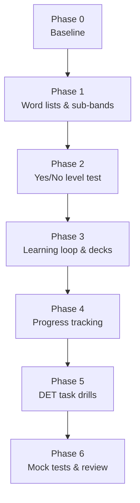

# Implementation phases

Build order for the DET 120 repo. Each phase ends with something usable;
later phases only add on top.



## Phase 0 — Baseline

Goal: know the starting point.

- [ ] Take one free DET practice test; record score + subscores in
      `progress.md`.
- [ ] Take a free yes/no vocabulary test (e.g. testyourvocab.com or LexTALE);
      record estimated size.
- [ ] Set the target test date.

Output: `progress.md` with a dated first row.

## Phase 1 — Word lists & sub-bands

Goal: one clean CSV per 500-word sub-band, 1K-a → 6K-b, plus AWL.

Sources (all free for personal use):

| Data | Source |
|------|--------|
| Word families by frequency rank | Paul Nation BNC/COCA lists, `basewrd1.txt` … `basewrd6.txt` |
| Academic words | Coxhead Academic Word List (570 families) |
| Zipf frequency | SUBTLEX-US |
| Prevalence | Brysbaert et al. 2019 word-prevalence norms |
| CEFR tag | Oxford 3000 / 5000 (tag only, not definitions) |
| GSE value | Pearson GSE Vocabulary, when it can be obtained |

Steps:

1. `scripts/fetch_raw.sh` downloads the sources into `data/raw/`;
   `scripts/extract_raw.py` turns the xlsx/pdf/html into slim TSVs in
   `data/extract/` (regenerated, not committed).
2. `scripts/build_bands.py` reads the cut table `vocab/subbands.csv`, ranks the
   6,000 families, joins the extra columns and writes **one file**,
   `vocab/index.csv`, with columns:

   ```
   family, subband, rank, pos_in_band, zipf, prevalence, cefr, gse, awl, pos, members, definition, example
   ```

   `definition` and `example` stay empty at first; they are filled in
   Phase 3. To study one level, filter on `subband`.
3. `scripts/audit_data.py` writes `data/AUDIT.md` (coverage, difficulty
   gradient, mirror check).
4. `vocab/my-words.csv` — same columns, empty, for words met in practice.

Output: `vocab/index.csv`, ~6,000 rows. Status: done (issue #1); grouping
refinements tracked in issue #2.

## Phase 2 — Yes/No level test

Goal: measure which sub-band the learner is at, in the DET *Read and Select*
format.

1. `scripts/gen_yesno.py <subband> [--n 20]` — picks N real words from the
   sub-band and N/2 pseudo-words (pronounceable non-words, e.g. from the ARC
   non-word database or generated by letter-swap), shuffles, prints or
   writes a test file.
2. `scripts/score_yesno.py` — reads answers, computes
   `hits − false alarms` (corrected score), writes a row to
   `vocab/tests/results.csv`: `date, subband, n, hits, false_alarms, score`.
3. Rule: **score ≥ 85% → mastered**. Test the next sub-band until one fails;
   that is the current level.

Output: a level estimate in ~10 minutes, repeatable weekly.

## Phase 3 — Learning loop & decks

Goal: learn the current sub-band as word families.

1. Fill `definition`, `example`, and `family` for the current sub-band
   (dictionary API or manual; short, simple English).
2. `scripts/export_anki.py <subband>` → `vocab/decks/<subband>.txt`, one card
   per family: front = base word, back = family forms + definition + example.
3. Daily: 15–20 new families + Anki review. One sub-band ≈ 500 families ≈
   4 weeks at 20/day.
4. Words from practice go to `my-words.csv` and into a separate deck.

Output: Anki decks and a daily routine.

## Phase 4 — Progress tracking

Goal: see the level move smoothly over time.

1. `scripts/report.py` — reads `vocab/tests/results.csv` and Anki stats
   (optional) and rewrites `vocab/progress.md`: table of % known per
   sub-band, estimated level, and a Mermaid line of scores over time.
2. Map highest mastered sub-band → estimated DET range (table in README).

Output: `progress.md` updated weekly.

## Phase 5 — DET task drills

Goal: practise each task type in test conditions.

```
practice/
├── listen-and-type/   # dictation sentences + answers
├── read-and-complete/ # cloze passages generated from short texts
├── read-aloud/        # sentence sets; record + self-check
├── speaking/          # photo + open prompts, 20 s prep / 90 s speak
├── writing/           # photo + open prompts, timed; keep all drafts
└── interactive/       # reading / listening practice notes
```

- One speaking + one writing task per day, timed.
- Reading/listening drills 3× per week.
- Errors found in drills → `vocab/my-words.csv` or a grammar note.

Output: dated practice files and an error log.

## Phase 6 — Mock tests & review

Goal: confirm 120 before booking.

- Full DET practice test every 1–2 weeks; log score + subscores.
- Review the weakest subscore each week and shift drill time to it.
- Book the real test when two consecutive practice tests are ≥ 120.

## Not planned (yet)

- A web/app UI. CSV + scripts + Anki are enough until the routine is stable.
- Automatic speaking/writing scoring. Self-review with a checklist first.
