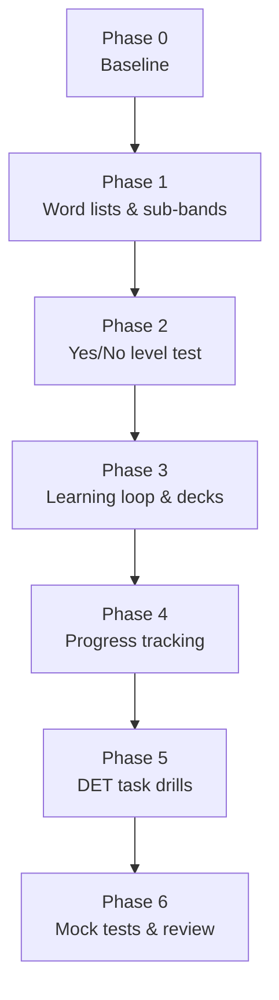

# Implementation phases

Build order for the DET 120 repo. Each phase ends with something usable;
later phases only add on top.



## Phase 0 — Baseline

Goal: know the starting point. Specified in issue #7.

- [ ] Take one free DET practice test; record it as row 1 of
      `vocab/tests/mocks.csv` (low end of the range as `overall`, `weakest`
      from the self-review) and point to it from `vocab/progress.md`.
- [ ] Take a free yes/no vocabulary test (LexTALE; testyourvocab.com
      optional); record the result in `vocab/progress.md`.
- [x] Set the target test date: 2027-03-03, not booked (README § Goal,
      `vocab/progress.md`).
- [x] Copy the first level-test rows (`vocab/tests/levels.csv`) and the
      pooled sub-band table from *What to learn* into `vocab/progress.md`.

Output: `vocab/progress.md` — a hand-written baseline section on top and an
empty block between `<!-- generated:start -->` / `<!-- generated:end -->`
markers that Phase 4 rewrites — plus `vocab/tests/mocks.csv` (header only
until the practice test is taken). Status: in progress (#7); the files and the
target date are in, the two tests and one more level-test session on a later
day are manual and still to do.

## Phase 1 — Word lists & sub-bands

Goal: one clean CSV per 500-word sub-band, 1K-a → 6K-b, plus AWL.

Sources (all free for personal use):

| Data | Source |
|------|--------|
| Word families by frequency rank | Paul Nation BNC/COCA lists, `basewrd1.txt` … `basewrd6.txt` |
| Academic words | Coxhead Academic Word List (570 families) |
| Zipf frequency | SUBTLEX-US |
| Prevalence | Brysbaert et al. 2019 word-prevalence norms |
| CEFR tag | Oxford 3000 / 5000 (tag only, not definitions) |
| GSE value | Pearson GSE Vocabulary, when it can be obtained |

Steps:

1. `scripts/fetch_raw.sh` downloads the sources into `data/raw/`;
   `scripts/extract_raw.py` turns the xlsx/pdf/html into slim TSVs in
   `data/extract/` (regenerated, not committed).
2. `scripts/build_bands.py` reads the cut table `vocab/subbands.csv`, ranks the
   6,000 families, joins the extra columns and writes **one file**,
   `vocab/index.csv`, with columns:

   ```
   family, subband, rank, pos_in_band, zipf, prevalence, cefr, gse, awl, pos, members, definition, example
   ```

   `definition` and `example` are filled by `scripts/build_dict.py` (issue
   #3), which also writes `vocab/senses.csv` (up to 3 senses per family) and
   `vocab/relations.csv` (synonym / antonym / similar links between
   families) from Open English WordNet. To study one level, filter on
   `subband`.
3. `scripts/audit_data.py` writes `data/AUDIT.md` (coverage, difficulty
   gradient, mirror check).
4. `vocab/my-words.csv` — words met in practice, a slim schema joined to
   `index.csv` on `family` (re-cut in Phase 3, issue #8): `date, family,
   source, note, done`. `source` = `test` (pinned on the result page),
   `learn` (the *Add a word* box) or a Phase 5 task id; `note` = meaning or
   the sentence it was met in; `done` = the date it went into a deck.

Output: `vocab/index.csv`, 6,000 rows, plus `senses.csv` and
`relations.csv`. Status: done (issues #1, #2, #3).

## Phase 2 — Yes/No level test

Goal: measure which sub-band the learner is at, in the DET *Read and Select*
format, adaptively. Specified in issue #4; UI prototype in `design/level-test/`.

1. `scripts/build_pseudowords.py` picks ~120 invented words per sub-band from
   the British Lexicon Project nonwords (native rejection ≥ 95 %, not in any
   of our word lists, length-matched to the sub-band) → `vocab/pseudowords.csv`.
2. `app/` — FastAPI backend + one static page. Staircase: start at `4k-a`;
   block = 10 real + 5 invented words; score `hits/10 − false alarms/5`;
   ≥ 0.85 → up one sub-band, else down; stop on the 2nd reversal, after 6
   blocks, or at the end of the scale. Level = highest sub-band whose pooled
   score is ≥ 0.85; false-alarm rate > 25 % → unreliable.
3. Output per session, saved while the test runs (issue #5):
   `vocab/tests/sessions/<id>.json` (every item and answer, resumable), one
   row per block in `vocab/tests/results.csv`, one row per wrong answer in
   `vocab/tests/misses.csv` (`miss` / `false_alarm`, with answer time), one
   row per session in `vocab/tests/levels.csv`. Schemas: `vocab/tests/README.md`.
4. `tests/` simulate a learner at every sub-band and a guesser.

Output: a level estimate in ~5 minutes, repeatable weekly. Status: done (issue #4).

## Phase 3 — Learning loop & decks

Goal: learn the current sub-band as word families, and close the loop
`test → learn → re-test after 1 week` inside the app.

Status: done (issues #6 and #8). The study list (`app/learn.py`) reads
`vocab/tests/`, finds the frontier sub-band and orders repeat misses →
my-words → frontier misses → other misses → slow answers → the rest of the
frontier by rank; every deck goes through the same `card_entry()` /
`export_anki()` pair, so the Learn button and the CLI can never produce
different cards. README § *What to learn* is the user-facing summary.

1. `definition` and `example` come from `build_dict.py`; hand-simplified
   ones for the current sub-band go in `vocab/overrides.csv` (`family,
   definition, example`), applied when the app loads and never rewritten by
   a script. `scripts/export_anki.py <subband> --check` lists the families
   that still have no example containing the word.
2. `scripts/export_anki.py <subband>` → `vocab/decks/<subband>.txt`: one note
   per family for the `DET family` note type ([docs/anki.md](anki.md)), two
   cards — *Recognise* (word → forms, definition, example, synonyms) and
   *Recall* (definition + the example with the word gapped, or a hint, and a
   typing box). `--batch N` = the Learn button, `--my-words` = the practice
   words. Re-importing a regenerated file updates the notes.
3. Daily: 15–20 new families + Anki review. One sub-band ≈ 500 families ≈
   4 weeks at 20/day.
4. Words from practice go to `vocab/my-words.csv` (`learn.add_my_word()`:
   *Pin* on the result page, *Add a word* on the Learn page, Phase 5 drills)
   and show up on the study list right after the repeat misses; the Learn
   button or `--my-words` exports them and marks them `done`.
5. Re-test: the start page shows *Re-test `<frontier>` due in N days* (7 days
   after the last reliable test) and a button that starts the staircase in
   the frontier sub-band.

Output: Anki decks, a daily routine and the re-test reminder.

## Phase 4 — Progress tracking

Goal: see the level move smoothly over time. Specified in issue #9.

Status: done (#9). README § *Track progress* is the user-facing summary.

1. `scripts/report.py` — reads `vocab/tests/` (`sessions/*.json`,
   `levels.csv`) and Anki review stats (optional, `--anki` on a copy of
   `collection.anki2`) and rewrites `vocab/progress.md`: the *Now* line
   (pooled level, DET range, frontier, trend), a table of % known and pooled
   score per sub-band, the word-status counts and a Mermaid line of the
   level over test dates. It replaces only the text between the
   `<!-- generated:start -->` and `<!-- generated:end -->` markers (each
   alone on its line, exactly once) and never touches the hand-written
   baseline above them; the full rule table is in issue #7 § 6, implemented
   by `app/progress.py:splice()`. `--check` cross-checks `levels.csv` and
   `results.csv` against the session JSON.
2. Map highest mastered sub-band → estimated DET range (table in README):
   done in Phase 2 (#4, #5) — `vocab/subbands.csv` carries the range, the
   result page and `levels.csv` show it.
3. `GET /api/progress` returns the same report dict; the *What to learn*
   page draws the level chart once two test days are on file. Mock-test rows
   (`vocab/tests/mocks.csv`) are added to the block by Phase 6 (#11).

Output: `progress.md` updated after every test.

## Phase 5 — DET task drills

Goal: practise each task type in test conditions.

```
practice/
├── listen-and-type/   # dictation sentences + answers
├── read-and-complete/ # cloze passages generated from short texts
├── read-aloud/        # sentence sets; record + self-check
├── speaking/          # photo + open prompts, 20 s prep / 90 s speak
├── writing/           # photo + open prompts, timed; keep all drafts
└── interactive/       # reading / listening practice notes
```

- One speaking + one writing task per day, timed.
- Reading/listening drills 3× per week.
- Errors found in drills → `vocab/my-words.csv` or a grammar note.

Output: dated practice files and an error log.

## Phase 6 — Mock tests & review

Goal: confirm 120 before booking.

- Full DET practice test every 1–2 weeks; log score + subscores.
- Review the weakest subscore each week and shift drill time to it.
- Book the real test when two consecutive practice tests are ≥ 120.

## Not planned (yet)

- Automatic speaking/writing scoring. Self-review with a checklist first.
- IRT/CAT scoring (catsim) for the level test: a continuous score with a
  confidence interval. File separately if the sub-band staircase feels coarse.
