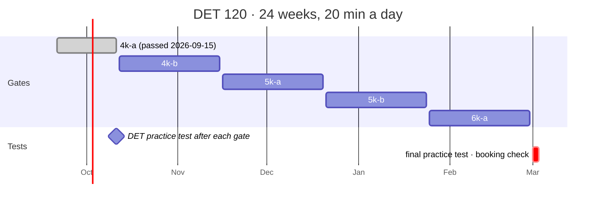
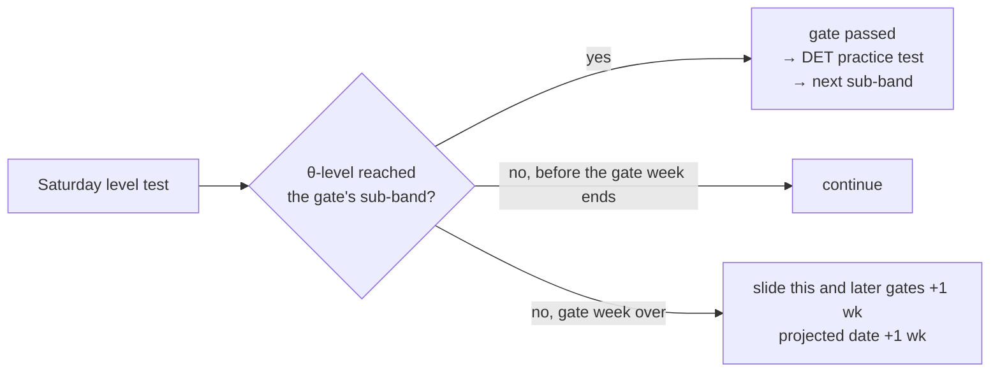

# Schedule

The learning schedule (issue #19): **20 minutes a day, six days a week**, five
sub-band gates from `4k-a` to `6k-a` and a target test date of **2027-03-03**.
Chosen on 2026-09-17 from a set of options: 20 min a day, the same routine
every day, sub-band gates as the measure, the plan in the app, one drill a day
alternating, Sunday off, a level test every week and the free DET practice
test at each gate, and a missed gate *slides the date* instead of raising the
daily load.

The plan lives in `vocab/plan.csv` (five rows: `subband, week, due`), the
*Words done* ticks in `vocab/plan-log.csv` (`date, words`); everything else
the plan needs is already on disk (drills in `practice/attempts.csv`, tests in
`vocab/tests/`). `app/plan.py` turns those files into the *Today* card on the
home page and the *Plan* section of [vocab/progress.md](../vocab/progress.md).

```bash
.venv/bin/python scripts/plan.py init --start 2026-09-21   # a Monday: writes vocab/plan.csv (refuses to overwrite without --force)
.venv/bin/python scripts/plan.py                            # where the plan stands: week, streak, gates, projected date
```

## A week

| Day | 20 minutes |
|-----|-----------|
| Mon–Fri | **Words 10 min** — the *Words* page or its Anki deck: the priority pool first, then the next new families of the frontier — then **one drill 10 min**: *Listen and Type* on odd session days, *Read and Complete* / *Fill in the Blanks* on even ones |
| Sat | **Words 10 min** → **Level test** (the CAT, ~2 min a block; it is also the weekly re-test) |
| Sun | off — the streak does not break on a Sunday |

Session days are the Mon–Fri days counted from the plan start, so a missed
day does not change the alternation, and because a week has five of them the
odd week starts with dictation and the even week with cloze — balanced over a
fortnight. Speaking and writing are not in the daily plan; they get their real
workout at each gate's DET practice test and stay one click away on the home
page.

## Gates

Week 1 starts Monday 2026-09-21. A gate is **passed** on the first reliable
level test whose θ-level (`irt.level_of`, the sub-band the home page shows,
the point where P(correct) = 0.85) reaches the gate's sub-band — the same
number the DET estimate is read from, so `6k-a` passed ≡ estimate ≥ 120. The
drills move θ between tests, but only a test passes a gate. Each gate passed
triggers one **free DET practice test** (englishtest.duolingo.com, test
conditions) → a row in `vocab/tests/mocks.csv`.

| Gate | Sub-band | By (Sunday) | Weeks | New-family budget (8 × 6 × weeks) |
|------|----------|-------------|-------|------------------------------------|
| 1 | `4k-a` | 2026-10-11 (wk 3) | 3 | 144 — already passed on 2026-09-15 |
| 2 | `4k-b` | 2026-11-15 (wk 8) | 5 | 240 (≈ 200 unknown) |
| 3 | `5k-a` | 2026-12-20 (wk 13) | 5 | 240 |
| 4 | `5k-b` | 2027-01-24 (wk 18) | 5 | 240 |
| 5 | `6k-a` | 2027-02-28 (wk 23) | 5 | 240 |
| — | final practice test, booking check (#11) | week 24 → **2027-03-03** | 1 | |



A gate is 0.85, not 500 words: ~79 % of `4k-a` and ~60 % of `4k-b` were known
on 2026-09-16, so the real load over the five sub-bands is roughly 1,100–1,200
unknown families, ≈ 8 new a day over six-day weeks. Twenty minutes fits that
with no slack, which is why the fall-back is *slide*, not *work more*.

## When a gate is missed — slide

If a gate's week ends and the sub-band is not passed, that gate and every
later one move by whole weeks until it passes, and the projected test date is
`2027-03-03 + the total slide`. A gate passed early moves nothing (the slack
stays). The home page and the report show the projected date whenever it
differs from the target.



Worked example: gate 2 (`4k-b`) is due Sunday 2026-11-15. On Monday
2026-11-16 it is *late by 1 wk*: its new deadline is 2026-11-22, `5k-a` moves
to 2026-12-27 and so on, and the projected date is 2027-03-10. Passing it on
Saturday 2026-11-21 records the slide as one week; passing it on 2026-11-28
makes it two.

## Streak

A day counts when it has at least one drill attempt (`practice/attempts.csv`),
one finished level-test block (`vocab/tests/results.csv`) or a *Words done*
tick (`vocab/plan-log.csv`). Sundays are skipped, neither counted nor breaking
the chain, and today may still be open: the streak counts back from today when
today is done, otherwise from yesterday.

## The Today card

```
TODAY · THU 24 SEP                        week 1 of 24 · on track
[✓] Words · 10 min                                        Words →
[ ] Read and Complete · 10 min · 0 done                   Start →
streak 4 · gate 4k-b by Sun 15 Nov (in 8 wk) · projected 2027-03-03
```

The words tick is the one thing clicked by hand (`POST /api/plan/words`, one
row a day); the drill tick comes from today's attempts of that drill group
(cloze days count *Read and Complete* and *Fill in the Blanks* together), the
Saturday tick from a finished test block. *Start →* opens today's drill, or the
level test on Saturday. Before the start date the card says *starts Mon 21
Sep*; on a Sunday it shows the day off. A late plan shows *late by N wk* in
red and the projected date with the target beside it. The same dict is `plan`
in `GET /api/config`.

## Files and code

| Piece | Where |
|-------|-------|
| Gates | `vocab/plan.csv` — `subband, week, due`; `scripts/plan.py init` writes it, the file is hand-editable (week 1's Monday = gate 1's `due` − `week` weeks + 1 day) |
| Words ticks | `vocab/plan-log.csv` — `date, words`; appended by the home page |
| Rules | `app/plan.py` — `make()`, `session_day()` / `drill_for()`, `gates()` (the slide), `streak()`, `today_plan()`; pure functions over loaded rows |
| API | `plan` in `GET /api/config` and `GET /api/progress`; `POST /api/plan/words` |
| Report | `progress.plan_lines()` → the *Plan* section between **Ability over time** (or **Anki**) and **Mock tests** |
| Tests | `tests/test_plan.py` — the slide, the early pass, the streak and Sunday, the alternation, the API tick, the section, the CLI |
