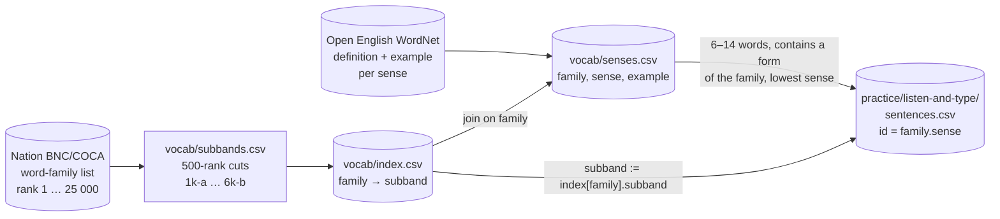
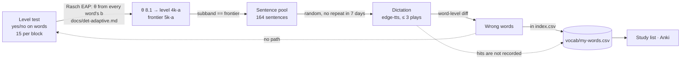

# Where the sentences come from, and what their band means

The drills (`read-and-complete`, `listen-and-type`, `read-aloud`) show
sentences tagged with a sub-band such as `4k-a`. This page records how that
tag is made, how far it reflects the difficulty of the sentence, and which
links between *what I know*, *what I hear* and *what gets recorded* exist
today. Nothing here is a classifier: **a sentence has no band of its own — it
inherits the band of the one word it was fetched for.**

## Two downloads, one join



| Step | Source | Rule | Where |
|---|---|---|---|
| Word band | Nation BNC/COCA family list (downloaded) | mechanical cut every 500 ranks: `1k-a` = 1–500 … `6k-b` = 5 501–6 000 | `vocab/subbands.csv`, `vocab/index.csv` |
| Sentence | Open English WordNet (downloaded) | the sense's `example` field, up to 3 senses per family | `vocab/senses.csv` |
| Sentence band | — | copied from the target family: `subband := index[family].subband` | `app/drills.py` `sentence_candidates()` |
| Dictation bank | `senses.csv` | one row per family: the lowest sense whose example is 6–14 words and contains a form of the family | `app/drills.py` `build_sentences()` |
| Cloze pool | `senses.csv` | same filter without the 14-word cap; the damaged words always include the target | `app/main.py` `cloze_pool()` |

`index.csv` also carries Zipf frequency (SUBTLEX-US), prevalence (Brysbaert
2019) and Oxford CEFR per word. They are stored for re-cutting the lists and
are **not** used by any drill.

## What the band tells you — and what it does not

Because the tag comes from one word, the other 5–13 words of the sentence are
whatever WordNet wrote. Measured on the bank built from the current
`senses.csv` (2 326 sentences; `off-list` = tokens with no `index.csv`
family, mostly names, numbers and contractions):

| Band | Sentences | Target is the hardest word | Has a harder word | Off-list tokens |
|---|---|---|---|---|
| 1k-a | 308 | 82 | 226 | 3% |
| 1k-b | 259 | 115 | 144 | 3% |
| 2k-a | 273 | 150 | 123 | 4% |
| 2k-b | 194 | 133 | 61 | 4% |
| 3k-a | 239 | 171 | 68 | 3% |
| 3k-b | 200 | 160 | 40 | 5% |
| 4k-a | 164 | 140 | 24 | 3% |
| 4k-b | 166 | 141 | 25 | 4% |
| 5k-a | 129 | 119 | 10 | 4% |
| 5k-b | 146 | 135 | 11 | 4% |
| 6k-a | 121 | 119 | 2 | 5% |
| 6k-b | 127 | 127 | 0 | 4% |

Read it as: at the frontier (`4k-a`) a sentence is, in 140 of 164 cases,
"everything below the frontier plus one word at the edge" — a fair dictation
item by accident, not by design. At the low end the tag means little: three
quarters of the `1k-a` sentences contain a word from a higher band, so a
"1k-a sentence" is not an easy sentence. Length, grammar, idiom (`where
there's a will, there's a way`), the voice's speed and accent are not graded
at all.

To reproduce the table:

```python
import csv
from app import drills
from app.main import BANK, FORMS
order = [f"{k}k-{h}" for k in range(1, 7) for h in "ab"]
rows = list(csv.DictReader(open("practice/listen-and-type/sentences.csv")))
for b in order:
    rs = [r for r in rows if r["subband"] == b]
    hardest = sum(max((BANK.index[FORMS[w.lower()]]["subband"] for w in drills.words(r["sentence"])
                       if w.lower() in FORMS), key=order.index) == b for r in rs)
    print(b, len(rs), hardest)
```

## The chain today: level → sentence → feedback



| Link | Exists? | How |
|---|---|---|
| word level → which sentence | yes | the target family is in the frontier sub-band — the sub-band containing `θ` (`learn.frontier()`, [det-adaptive.md](det-adaptive.md)) |
| word level → sentence difficulty | incidental | see the table above; nothing computes it |
| sentence errors → my-words | yes | a wrong word that maps to an `index.csv` family → `learn.add_my_word(source = task)` |
| sentence errors → word status or level | no | `learn.word_stats()` reads the level-test sessions only; a dictation error never changes `repeat / missed / shaky / known` or the frontier |
| sentence hits → evidence of knowing | no | only the `errors` column is written; a correct word leaves no trace |
| kind of error (hearing, spelling, vocabulary) | no | *ward → word* and an unknown *evict* are logged the same way |

## What would close the loop

Tracked in issue #13 (priority pool), #15 (text difficulty), #16 (adaptive
dictation) and #17 (cloze on the scale). The foundation is built: issue #14
put every word and the learner on one scale — a difficulty `b` per word
(the continuous band index, `1k-a` = 0–1 … `6k-b` = 11–12) and an ability
`θ` that the level test now estimates word by word (Rasch model,
[docs/det-adaptive.md](det-adaptive.md)). The three items below are what
the drills still need on top of it.

1. **Drill evidence feeds word status.** A family heard and typed right on two
   different days counts as known; wrong counts as missed. `word_stats()` then
   merges test and drill evidence, and the Learn page and the frontier react
   to what is heard, not only to what is clicked.
2. **A difficulty number per sentence** (`b_text`, #15), stored in
   `sentences.csv` from the words' `b`, length and off-list count, on the
   same scale as `θ`. Dictation can then draw sentences with `b_text` near
   `θ` and feed its answers back into `θ` with partial credit (#16), the way
   the level test already does for words — instead of drawing at random
   inside one band.
3. **Error kinds.** Same-sound substitution (*ward / word*) is listening;
   the target family wrong is vocabulary; a near miss in letters is spelling.
   Each gets its own tag in `my-words.csv` and its own follow-up drill.
