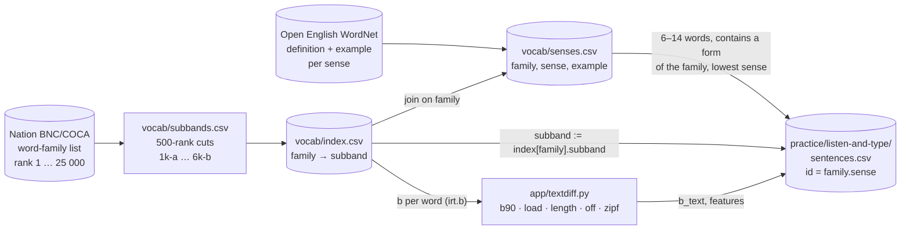
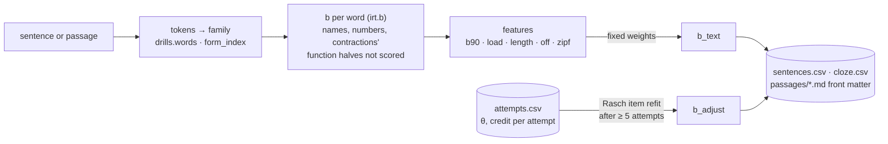
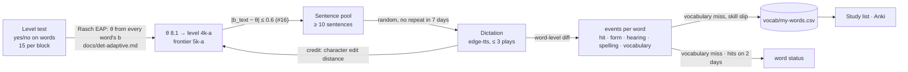

# Where the sentences come from, and what their band means

The drills (`read-and-complete`, `listen-and-type`, `read-aloud`) show
sentences tagged with a sub-band such as `4k-a`. This page records how that
tag is made, how far it reflects the difficulty of the sentence, how the
difficulty number `b_text` is computed from the sentence itself, and which
links between *what I know*, *what I hear* and *what gets recorded* exist
today. **The band tag is not a difficulty: a sentence inherits the band of
the one word it was fetched for.** The difficulty is `b_text` (issue #15,
`app/textdiff.py`), on the same scale as the learner's `θ`
([det-adaptive.md](det-adaptive.md)), computed from every word of the
sentence — see *How difficulty is computed* below.

## Two downloads, one join



| Step | Source | Rule | Where |
|---|---|---|---|
| Word band | Nation BNC/COCA family list (downloaded) | mechanical cut every 500 ranks: `1k-a` = 1–500 … `6k-b` = 5 501–6 000 | `vocab/subbands.csv`, `vocab/index.csv` |
| Sentence | Open English WordNet (downloaded) | the sense's `example` field, up to 3 senses per family | `vocab/senses.csv` |
| Sentence band | — | copied from the target family: `subband := index[family].subband` | `app/drills.py` `sentence_candidates()` |
| Dictation bank | `senses.csv` | one row per family: the lowest sense whose example is 6–14 words and contains a form of the family | `app/drills.py` `build_sentences()` |
| Cloze pool | `senses.csv` | same filter without the 14-word cap; the damaged words always include the target; cached with its `b_text` in `practice/read-and-complete/cloze.csv` | `app/main.py` `cloze_pool()` |
| Sentence difficulty | the sentence's own words | `b_text` from the words' `b`, the length and the off-list count (below); `b_adjust` from own responses after 5 attempts | `app/textdiff.py`, the `b_text, b_adjust, features` columns |
| Passage difficulty | `practice/read-and-complete/passages/*.md` | the same `b_text`, written into the front matter by `scripts/passages.py score` | `b_text:`, `b_adjust:`, `features:` |

`index.csv` also carries Zipf frequency (SUBTLEX-US), prevalence (Brysbaert
2019) and Oxford CEFR per word. Zipf enters `b_text` (the mean over the
content words); prevalence and CEFR are stored for re-cutting the lists and
are not used by any drill.

## What the band tells you — and what it does not

Because the tag comes from one word, the other 5–13 words of the sentence are
whatever WordNet wrote. Measured on the bank built from the current
`senses.csv` (2 326 sentences), `b_text` per source band — the count of
sentences in each `b_text` range and the median:

| Band | Sentences | 0–2 | 2–4 | 4–6 | 6–8 | 8–10 | 10–12 | ≥ 12 | Median b_text |
|---|---|---|---|---|---|---|---|---|---|
| 1k-a | 308 | 139 | 80 | 42 | 20 | 16 | 10 | 1 | 2.20 |
| 1k-b | 259 | 83 | 97 | 26 | 22 | 23 | 6 | 2 | 2.63 |
| 2k-a | 273 | 0 | 166 | 56 | 27 | 14 | 9 | 1 | 3.32 |
| 2k-b | 194 | 0 | 103 | 59 | 15 | 10 | 7 | 0 | 3.97 |
| 3k-a | 239 | 0 | 1 | 190 | 25 | 14 | 7 | 2 | 4.93 |
| 3k-b | 200 | 0 | 1 | 108 | 72 | 9 | 8 | 2 | 5.93 |
| 4k-a | 164 | 0 | 0 | 0 | 141 | 11 | 12 | 0 | 6.78 |
| 4k-b | 166 | 0 | 0 | 0 | 113 | 48 | 5 | 0 | 7.75 |
| 5k-a | 129 | 0 | 0 | 0 | 0 | 122 | 7 | 0 | 8.77 |
| 5k-b | 146 | 0 | 0 | 0 | 0 | 104 | 41 | 1 | 9.78 |
| 6k-a | 121 | 0 | 0 | 0 | 0 | 0 | 119 | 2 | 10.88 |
| 6k-b | 127 | 0 | 0 | 1 | 0 | 0 | 93 | 33 | 11.70 |

Read it as: the median rises with the band, so the tag orders the bank on
average — but every band spreads over four or more ranges. At the low end the
tag means little: the target is the hardest word of the sentence in only 36
of the 308 `1k-a` sentences (in 126 of 127 at `6k-b`), so 169 of them score
above `b_text = 2` and a "1k-a sentence" is not an easy sentence. From `4k-a`
up the target usually *is* the hardest word, and the sentence lands inside
its own band — a fair item by accident, not by design; `b_text` makes it
one by design once #16 draws on `b_text` instead of the tag. Grammar, idiom
(`where there's a will, there's a way`), the voice's speed and accent are
still not graded.

To reproduce the table: `.venv/bin/python scripts/report.py --sentences`
(it builds `practice/listen-and-type/sentences.csv` when the file is
missing, exactly as the app does).

## How difficulty is computed

`app/textdiff.py` predicts a text item's difficulty from its words and its
length before anyone answers it — the same idea as the DET's model for
C-test passages, dictation sentences and read-aloud items (Settles, LaFlair &
Hagiwara 2020) — on the `b` scale of `app/irt.py`, so `b_text` compares
directly with the learner's `θ`.



**Tokens.** `drills.words()` splits the text; each token goes through
`form_index()` (headword or member → family) to the family's `b`. A
capitalised token inside a sentence is a name and is not scored; a token
with a digit is a number and is not scored; a contraction or possessive is
split at the apostrophe — the stem is scored (`doesn't` → `doesn` → the `do`
family), the function half (`t`, `s`, `re`, `ve`, `ll`, `d`, `m`) is dropped.
A lower-case token with no family is **off-list**. A scored token is a
**content word** unless its family is a function word (first `pos` tag in
`textdiff.FUNCTION_POS`: `the`, `a`, `of`, `who`, `can`, `and` …), so the
features describe the words that carry the meaning.

| Feature | Definition | Why |
|---|---|---|
| `b90` | 90th percentile (nearest rank) of the content words' `b` — the maximum up to nine content words, the second-highest from ten | the hardest words decide whether the text is understood (lexical coverage, Nation 2006); in a passage one odd word does not |
| `load` | content words with `b > b90 − 1` | one hard word is a lookup, three are a wall |
| `length` | tokens, counted up to 20 | working memory in dictation, blanks in a C-test; past twenty tokens a text is read, not held, so a 50–80-word passage stays on the scale |
| `off` | off-list content tokens | unknown to the bank = unknown to the learner |
| `zipf` | mean SUBTLEX Zipf of the content words | rare-on-average text is harder even when no single word is |

```
b_text = b90 + 0.15 · max(0, load − 1) + 0.08 · max(0, min(length, 20) − 8)
             + 0.6 · off + 0.4 · max(0, 4.5 − zipf)
```

The weights are constants at the top of `app/textdiff.py` with their intent;
they order sentences on the `b` scale, they do not claim to predict a DET
score. `textdiff.features()` returns the raw numbers, `textdiff.b_text()` the
combination; the `features` column of `sentences.csv` and the passage front
matter keep them as `k=v;…` so any number can be checked by hand.

Worked example, `the landlord can evict a tenant who doesn't pay the rent`:

| token | family | `b` | counted as |
|---|---|---|---|
| the, a, the | the, a | 0.006, 0.010 | function |
| can, who | can, who | 0.046, 0.106 | function |
| landlord | landlord (`4k-a`) | 6.362 | content |
| evict | evict (`6k-b`) | 11.662 | content |
| tenant | tenant (`4k-a`) | 6.530 | content |
| doesn't | do (`1k-a`) | 0.036 | content (stem; `t` dropped) |
| pay | pay (`1k-a`) | 0.470 | content |
| rent | rent (`1k-b`) | 1.744 | content |

Six content words → `b90 = 11.662` (the maximum, `evict`); `load = 1` (no
other word within one band of it); `length = 11` → `0.08 · 3 = 0.24`;
`off = 0`; `zipf = 4.467` → `0.4 · 0.033 = 0.013`. So
`b_text = 11.662 + 0 + 0.24 + 0 + 0.013 = 11.915`, written as
`b_text = 11.92`: a sentence for a learner near the top of the scale, whatever
its `1k-a` target (`pay`) says. Replace `evict` with `remove` (`2k-a`, 2.44)
and the same sentence scores `b_text = 6.92` — `tenant` becomes the hardest
word and `landlord` joins the load.

**Own-response refinement.** The DET refines a predicted difficulty from
test-taker responses; here the same thing on one learner's scale. Once an
item has ≥ 5 attempts, `textdiff.refit(b_text, [(θ, credit), …])` re-estimates
its `b` by a one-dimensional Rasch item update — Newton steps on the item
log-likelihood given the `θ` at each attempt (a credit in `0 … 1` enters as
`P^s · (1 − P)^(1 − s)`, like `irt.eap()`), each step bounded to one band and
the shift to three — and shrinks the result toward the prediction with weight
`5 / (5 + n)`. The difference is stored as `b_adjust` (a `sentences.csv` and
`cloze.csv` column, a passage front-matter line; `0` until then) and the item
plays at `b = b_text + b_adjust`. `textdiff.refit_bank()` reads
`practice/attempts.csv` for it after every dictation answer — rows carry `θ`
from #16 on; rows without it are skipped.

## The chain today: level → sentence → feedback



| Link | Exists? | How |
|---|---|---|
| word level → which sentence | yes | the target family is in the frontier sub-band — the sub-band containing `θ` (`learn.frontier()`, [det-adaptive.md](det-adaptive.md)) |
| word level → sentence difficulty | dictation: yes | `b_text` per sentence and passage (above); Listen and Type and Read Aloud draw from `\|b − θ\| ≤ 0.6` (#16, [det-adaptive.md](det-adaptive.md) § *Dictation*); the cloze drills still draw by the band tag until #17 |
| sentence errors → my-words | yes | a wrong word that maps to an `index.csv` family → `learn.add_my_word(source = task)`; a hearing / spelling / form slip under `source = task:kind`, shown as *heard wrong*, never a card |
| sentence errors → word status or level | dictation: yes | `learn.word_stats()` merges the `events` of `attempts.csv` with the test sessions: a `vocabulary` miss is a "no"; the credit moves `θ` (#16) |
| sentence hits → evidence of knowing | dictation: yes | every content word typed right is a `hit` event; two hit days with no later miss make the word `known` |
| kind of error (hearing, spelling, vocabulary) | dictation: yes | *ward → word* is `hearing` (same Metaphone key, `app/phon.py`), *tennant → tenant* `spelling`, a missing *evict* `vocabulary` — the table in [practice/README.md](../practice/README.md) § Listen and Type |

## What would close the loop

Tracked in issue #13 (priority pool), #15 (text difficulty), #16 (adaptive
dictation) and #17 (cloze on the scale). The foundation is built: issue #14
put every word and the learner on one scale — a difficulty `b` per word
(the continuous band index, `1k-a` = 0–1 … `6k-b` = 11–12) and an ability
`θ` that the level test now estimates word by word (Rasch model,
[docs/det-adaptive.md](det-adaptive.md)). The difficulty number per
sentence and passage (`b_text`, #15, *How difficulty is computed* above) is
the second piece in place: dictation and cloze can now draw items with
`b_text` near `θ` and feed their answers back into `θ` with partial credit
(#16, #17), the way the level test already does for words — instead of
drawing at random inside one band. The two items below are what the drills
still need on top of it.

1. **Drill evidence feeds word status.** A family heard and typed right on two
   different days counts as known; wrong counts as missed. `word_stats()` then
   merges test and drill evidence, and the Learn page and the frontier react
   to what is heard, not only to what is clicked.
2. **Error kinds.** Same-sound substitution (*ward / word*) is listening;
   the target family wrong is vocabulary; a near miss in letters is spelling.
   Each gets its own tag in `my-words.csv` and its own follow-up drill.
