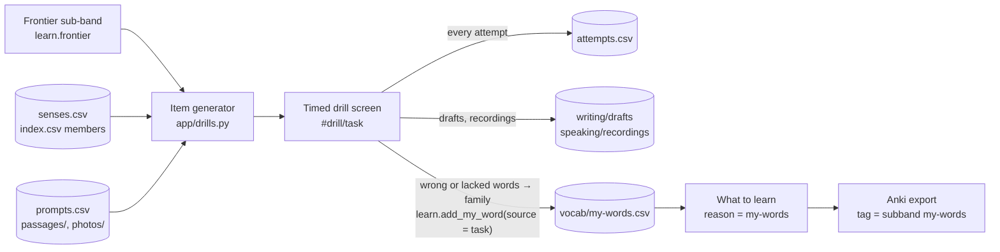

# Task drills

Every DET task type as a timed drill inside the app (issue #10, Phase 5):
open `http://localhost:8000`, pick a task under *Practise the tasks*, or go
straight to `#drill/<task>`. The real DET clock runs
([docs/det-format.md](../docs/det-format.md)); every attempt is one row of
`attempts.csv`, every draft and recording is kept under its attempt id, and
every word you got wrong or lacked lands in `vocab/my-words.csv` through
`learn.add_my_word()` so *What to learn* and the Anki export pick it up.

| `task` | Drill | Items from | Clock | Scored |
|---|---|---|---|---|
| `read-and-complete` | cloze: complete the damaged words (first letters given) | *sentence mode*: `vocab/senses.csv` examples of the frontier sub-band and the study list; *passage mode*: `read-and-complete/passages/*.md` | 1 min / 3 min | correct blanks ÷ blanks |
| `listen-and-type` | dictation: play ≤ 3 times, type the sentence | `listen-and-type/sentences.csv`, frontier sub-band, edge-tts audio | 1 min | 1 − word errors ÷ words |
| `read-aloud` | read the sentence; record | the same sentence bank | 20 s | self-rating |
| `speak-photo` | describe a photo; record | `speaking/photos/` (any image; a `prompts.csv` row can give it a prompt) | 20 s prep, 30–90 s | self-rating |
| `read-then-speak` | speak on a written prompt; record | `speaking/prompts.csv` | 20 s prep, 30–90 s | self-rating |
| `listen-then-speak` | the prompt is read aloud (≤ 3 plays); record | `speaking/prompts.csv`, edge-tts | 20 s prep, 30–90 s | self-rating |
| `write-photo` | one or more sentences about a photo | `speaking/photos/` | 1 min | self-rating, words |
| `read-then-write` | write on a prompt | `writing/prompts.csv` | 5 min, 50 words | self-rating, words |
| `interactive-writing` | part 1, then the row's `follow_up` on what you wrote | `writing/prompts.csv` | 5 min + 3 min, 50 words | self-rating, words |

A sentence's `subband` is the band of the word it was fetched for, nothing
more — what that does and does not tell you is measured in
[docs/sentences.md](../docs/sentences.md).

Read and Select is not drilled again: the weekly level test is that task.
Interactive Reading / Listening and the Samples: notes only, in
[interactive/README.md](interactive/README.md).

## The loop

## How each drill runs

**Read and Complete.** C-test damage, the rule of the real task: a word is
*eligible* when it is letters only, 3+ letters, not a capitalised word inside
a sentence (a name) and not a number; every second eligible word loses its
second half (`len // 2` letters kept, at least one: `skipped → ski____`,
`the → t__`). Sentence mode picks the parity that damages the target family's
form (headword or `members`), so the item always tests that family; passage
mode keeps the first sentence intact and damages the 2nd, 4th, … eligible
word after it. 2–5 blanks: an item that yields fewer is skipped, more are cut
to a window of 5 that contains the target, the window offset drawn from the
seed. Items are not stored — the id (`<family>.<sense>.<seed>` or
`<passage-slug>.<seed>`) regenerates them, and "not shown twice in a week" is
a lookup on the `item` column. Answer: exact match per blank, letters only,
case-insensitive. A wrong blank whose word maps to an `index.csv` family goes
to my-words with the sentence as the note (a proper noun in a passage is
logged in `attempts.csv` only).

Passages: paste 50–80 words into `read-and-complete/passages/<slug>.md`
(Simple English Wikipedia, CC BY-SA, is a good source) with a front-matter
block giving the `source:` URL; three examples are committed.

**Listen and Type.** `listen-and-type/sentences.csv` (`id, family, subband,
sentence, voice`) is built from `senses.csv` on the first request — one
6–14-word example per family whose text contains a form of the family, one
of four edge-tts accents per row — and is not committed, so the voices are
local to the machine. The MP3 is generated once (needs the internet) and
cached in `listen-and-type/audio/`; the second play needs no network. Score:
lower-case, punctuation stripped, `difflib.SequenceMatcher` on the word
lists; `delete` counts the missing reference words, `insert` the extra typed
words, `replace` the longer of its two spans; `score = max(0, 1 − errors ÷
reference words)`, so a long wrong answer stays at 0. Reference words in
`delete` and `replace` spans that map to a family go to my-words.

Both vocabulary drills map a wrong word to its family through `index.csv`
headwords and `members`; families the app never shows (two-letter ones such
as `be`, `a`, `to` — the same `bank.WORD` rule as the test) are logged in
`attempts.csv` but not added, so a blank dictation answer does not push
function words onto the study list.

**Speaking.** Prompt (or photo, or the prompt read by edge-tts), a 20 s
preparation countdown, then the browser's `MediaRecorder` starts by itself;
*Stop* unlocks after the 30 s minimum and the clock stops it at 90 s. The
recording is uploaded as `speaking/recordings/<attempt>.webm` and played back
next to the prompt on the result screen. Read Aloud has no preparation:
*Record* starts the 20 s clock on a sentence from the dictation bank.

**Writing.** Prompt (or photo), a textarea with a live word count against the
50-word minimum, a countdown; the draft is autosaved every 10 s and at the
end to `writing/drafts/<attempt>.md` (front matter `task, prompt, seconds,
words`, then the text under its prompt). Interactive Writing runs part 2 on
the `follow_up` prompt after part 1; one row, one draft file with two
sections, `seconds` and `words` summed. A second attempt at the same prompt
is a new file — nothing is overwritten.

**Self-rating and "words I lacked"** (speaking and writing): four lines, 1–5
each — task fulfilled, fluency, vocabulary range, grammar — stored as their
mean rounded half up in the `self` column. The *words I lacked* box takes a
comma-separated list; each word is looked up in `index.csv` (headword or
member) and added with `source = <task>` and `note = <prompt id>`; a word
outside the list is added under its own spelling and becomes an *extra* entry
on the study list (issue #8).

The start page shows today's attempts per task. Routine: one speaking and one
writing drill a day; cloze and dictation three times a week, 10 items each,
from the frontier sub-band.

## `attempts.csv`

One row per finished or timed-out attempt, every task type. Written by
`app/store.py:append_attempt()`.

| column | meaning |
|---|---|
| `date` | `YYYY-MM-DD` |
| `attempt` | `<date>_<HHMMSS>_<4 hex>` — the same shape as a test session id; also the recording / draft file name |
| `task` | one of the ids in the table above |
| `item` | cloze id (`<family>.<sense>.<seed>` or `<slug>.<seed>`, replayable), sentence id (`<family>.<sense>`) or prompt id |
| `subband` | the sub-band the item targets; blank for passages and prompts |
| `seconds` | time used, both parts summed for Interactive Writing |
| `timed_out` | `1` when the clock ran out |
| `score` | 0–1 for `read-and-complete` and `listen-and-type`; blank otherwise |
| `self` | 1–5 self-rating for speaking and writing; blank otherwise |
| `words` | blanks (cloze), reference words (dictation), words written (writing); blank for speaking |
| `errors` | `;`-separated `expected>typed` pairs (`sentence>sentance`, `so>` for a missing word, `>extra` for an extra one); empty when none |
| `file` | draft or recording path relative to `practice/`; blank for cloze and dictation |

## `speaking/prompts.csv` and `writing/prompts.csv`

| column | meaning |
|---|---|
| `id` | prompt id, the `item` of the attempt (`rts-01`, `lts-03`, `iw-02`, …) |
| `task` | the drill the row belongs to |
| `prompt` | the text shown (or read aloud for `listen-then-speak`) |
| `follow_up` | writing only: the part-2 prompt of an `interactive-writing` row; blank elsewhere |
| `photo` | file name in `speaking/photos/` for the photo tasks; blank elsewhere |
| `source` | where the prompt came from (`own`, `own photo`, a URL) |

Photo tasks draw from every image in `speaking/photos/` (jpg, png, webp);
a row is only needed to give a photo a prompt of its own. Photos, recordings,
the sentence cache and the audio cache are gitignored; drafts, prompts and
passages are committed.
