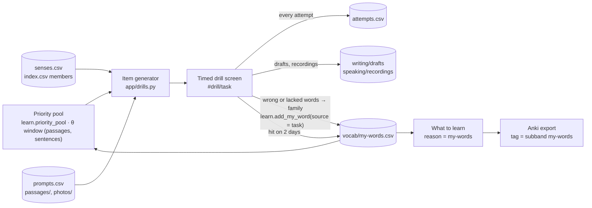
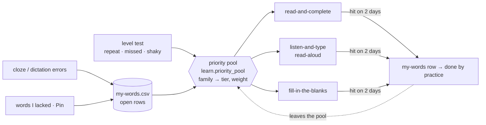
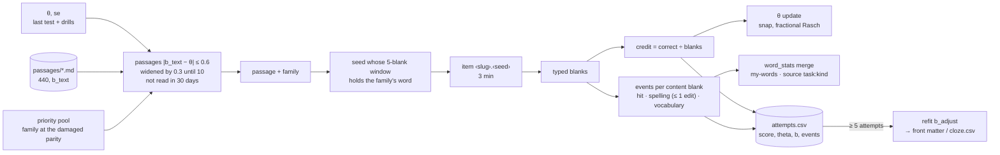
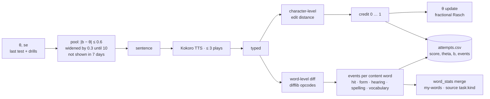

# Task drills

Every DET task type as a timed drill inside the app (issue #10, Phase 5):
open `http://localhost:8000`, pick a task from the *Practise* cards, or go
straight to `#drill/<task>`. The real DET clock runs
([docs/det-format.md](../docs/det-format.md)); every attempt is one row of
`attempts.csv`, every draft and recording is kept under its attempt id, and
every word you got wrong or lacked lands in `vocab/my-words.csv` through
`learn.add_my_word()` so *What to learn* and the Anki export pick it up. Each
answer ends with one git commit of the row, the draft and my-words
(`app/vcs.py`, issue #20); recordings are gitignored and stay local.

| `task` | Drill | Items from | Clock | Scored |
|---|---|---|---|---|
| `read-and-complete` | C-test: complete the damaged words (first half given) | *passage mode* (default): `read-and-complete/passages/*.md`, the 440-passage bank, passages with `b_text` near `θ`, a priority family damaged when one is in the window; *sentence mode*: `vocab/senses.csv` examples of the priority pool's families | 3 min / 1 min | credit = correct blanks ÷ blanks; moves `θ` |
| `fill-in-the-blanks` | one sentence, one word missing but for its first third (`ten____`) | `listen-and-type/sentences.csv`, sentences with `b` near `θ`, the priority pool's families first | 20 s | credit 1 / 0; moves `θ` |
| `listen-and-type` | dictation: play ≤ 3 times, type the sentence | `listen-and-type/sentences.csv`, sentences with `b` near `θ` (frontier sub-band before the first test), the priority pool's families first, Kokoro audio | 1 min | credit = 1 − character edits ÷ length; moves `θ` |
| `read-aloud` | read the sentence; record | the same sentence bank, the same order | 20 s | self-rating |
| `speak-photo` | describe a photo; record | `speaking/photos/` (any image; a `prompts.csv` row can give it a prompt) | 20 s prep, 30–90 s | self-rating |
| `read-then-speak` | speak on a written prompt; record | `speaking/prompts.csv` | 20 s prep, 30–90 s | self-rating |
| `listen-then-speak` | the prompt is read aloud (≤ 3 plays); record | `speaking/prompts.csv`, Kokoro audio | 20 s prep, 30–90 s | self-rating |
| `write-photo` | one or more sentences about a photo | `speaking/photos/` | 1 min | self-rating, words |
| `read-then-write` | write on a prompt | `writing/prompts.csv` | 5 min, 50 words | self-rating, words |
| `interactive-writing` | part 1, then the row's `follow_up` on what you wrote | `writing/prompts.csv` | 5 min + 3 min, 50 words | self-rating, words |

A sentence's `subband` is the band of the word it was fetched for, nothing
more; its difficulty is `b_text` (issue #15, `app/textdiff.py`) — predicted
from every word's `b`, the length and the off-list count on the same scale as
the learner's `θ`, stored next to the sentence in `sentences.csv` and
`cloze.csv` and in a passage's front matter, and returned as `b` with every
drill item. How the two relate is measured in
[docs/sentences.md](../docs/sentences.md), which also has the formula.

Read and Select is not drilled again: the weekly level test is that task.
Interactive Reading / Listening and the Samples: notes only, in
[interactive/README.md](interactive/README.md).

## The loop



## Which item comes next: the priority pool

Every drill knows which family an item was built for (`id = family.sense`),
and since issue #13 every vocabulary drill uses that link the same way:
**the words you missed come first** — in the level test (`repeat`, `missed`,
`shaky`) and in practice (open `vocab/my-words.csv` rows: cloze and
dictation errors, pins, *words I lacked*). The selection window on the θ/b
scale comes from #16 (dictation: `|b − θ| ≤ 0.6`) and #17 (passages and
Fill in the Blanks, the same window); the pool decides the **order inside
the window**.



`learn.priority_pool(stats, my_words, index, front)` → family →
`(reason, weight)`, the study list without its batch cap, so the Learn page
and the drills agree:

| Tier | Reason | Source | Weight |
|---|---|---|---|
| 1 | `repeat` | missed twice in the level test | 6 |
| 1 | `my-words` | open `vocab/my-words.csv` rows (drill errors, lacked words, pins; *heard wrong* rows too) | 6 |
| 2 | `missed` | missed once (frontier sub-band first) | 3 |
| 3 | `shaky` | right, but slow | 2 |
| 4 | `frontier` | the frontier sub-band, never shown | 1 |

A family outside `index.csv` (an *extra* my-words entry) has no sentence and
is skipped. `drills.pick_weighted(pool, recent, key, weight, rng)` draws with
`random.choices` over the items not shown in the last `NO_REPEAT_DAYS`, by
the family weight; weight-0 items are never drawn; when every weighted item
was shown this week it falls back to `pick()`. With a pool of 10 tier-1 words
against 500 frontier words the weights alone would give the missed words
11 % of the draws, so `PRIORITY_SHARE = 0.5` applies first: when any tier
1–3 family is available, the draw comes from those with probability 0.5,
otherwise from the weighted union — a small pool neither drowns in the
frontier nor stops the frontier from moving. The no-repeat rule is on the
**item** (sentence id), not the family: a priority family with three
example sentences can come back in another sentence the same week.

Per drill:

- **`read-and-complete`** (passage mode, #17): the passages with `b_text`
  within ±0.6 of `θ` (widened until ten), each weighted by the heaviest
  priority family it can damage — a family whose form stands at the damaged
  parity of the passage (`drills.passage_targets`); a passage with none is a
  frontier item (weight 1). The chosen family's word is always in the 5-blank
  window: the seed of the item id is searched until the window holds it
  (`drills.passage_seed`), so the id still replays the item. Sentence mode:
  the cloze candidates whose family is in the pool (any tier), weighted; the
  target family is always one of the damaged words.
- **`listen-and-type`, `read-aloud`, `fill-in-the-blanks`**: the #16 window
  first (`|b − θ| ≤ 0.6`, the frontier sub-band before the first test), then
  the pool weights inside it; a sentence whose family is outside the pool
  counts as a frontier one (weight 1) so the window stays wide. Fallback to
  the whole bank stays. Fill in the Blanks removes the sentence's own family
  — the word the row was built for — so the missing word is the pool's word.

**Closing the loop.** A family is a *hit* in an attempt when its `events`
entry says so (every content-word blank of a cloze item, the word of a
fill-in item, every content word typed right in a dictation — the same `hit`
event #16 writes). On every drill
answer `learn.practice_done()` marks an open my-words row done once its
family has hits on **two different days** since the row was added with no
error in between (`learn.drill_hits()`); the row's `done` reads `<date>
practice`, next to the plain export date of a row closed by a deck, and the
Learn page and `GET /api/progress` count the two apart (`done by cards`,
`done by practice`).

**Showing the why.** The item screen carries a chip with the reason — `missed
2× in the test`, `my-words · listen-and-type 2026-09-14`, `shaky`, nothing
for a frontier word (or a passage without one); the result screens of cloze,
fill-in and dictation mark the target family in the text; the practice page header reads `priority
pool: 23 words (my-words 9 · repeat 4 · missed 7 · shaky 3)`, the same
numbers `GET /api/progress` returns under `pool` and `vocab/progress.md`
prints under *Words*.

## How each drill runs

**Read and Complete** (issue #17 — the C-test on the DET scale of
[docs/det-adaptive.md](../docs/det-adaptive.md) § *Cloze*). C-test damage,
the rule of the real task: a word is *eligible* when it is letters only, 3+
letters, not a capitalised word inside a sentence (a name) and not a number;
every second eligible word loses its second half (`len // 2` letters kept, at
least one: `skipped → ski____`, `the → t__`). Passage mode — the default, the
DET's own form, 3 minutes — keeps the first sentence intact and damages the
2nd, 4th, … eligible word after it; sentence mode (the *Sentence mode*
button, `#drill/read-and-complete/sentence`, 1 minute) picks the parity that
damages the target family's form (headword or `members`), so the item always
tests that family. 2–5 blanks: an item that yields fewer is skipped, more are
cut to a window of 5 that contains the target, the window offset drawn from
the seed. Items are not stored — the id (`<passage-slug>.<seed>` or
`<family>.<sense>.<seed>`) regenerates them, and "not shown twice" is a
lookup on the `item` column: 30 days for a passage, 7 for a sentence.



- **Selection.** After the first reliable test the passage is drawn from
  those whose `b` (`b_text + b_adjust`) lies within ±0.6 of `θ`, the window
  widened by 0.3 until it holds ten; inside the window the priority pool's
  weights apply (§ *Which item comes next*: the passage's weight is that of
  the heaviest priority family standing at its damaged parity) and that
  family's word is always one of the five blanks. Before a test the window
  is built around the middle of the frontier sub-band.
- **Credit.** Exact match per blank, letters only, case-insensitive;
  `credit = correct ÷ blanks` is the `score` column and enters the learner's
  posterior against the passage's `b` as `P^s · (1 − P)^(1 − s)` after
  `irt.snap()` (`s ≥ 0.95` right, `s ≤ 0.2` wrong) — the same update as the
  dictation. The result screen shows `θ` before → after and the passage's
  `b`. Sentence mode does the same against the sentence's `b_text`.
- **Events.** Every blank whose word is a content word of the bank (a family
  that is not a function word and that the test can show — `t__` for `the`
  is scored but never word evidence) is one event, `family:kind`:

  | Blank | Kind |
  |---|---|
  | the answer, any case, punctuation ignored | `hit` |
  | within one letter edit of the answer (`sentance`) | `spelling` |
  | anything else, or empty | `vocabulary` |

  A `vocabulary` miss goes to my-words under `source = read-and-complete`
  with the blank's sentence as the note, a `spelling` slip under
  `read-and-complete:spelling` (never exported as a card); `learn.word_stats`
  merges them like the dictation events (#16).
- **Refit.** After every answer `textdiff.refit_bank()` re-estimates the
  passage's (or the sentence's) `b_adjust` from the `(theta, score)` pairs on
  record (≥ 5 attempts) and writes it back into the passage's front matter
  (`b_adjust:`) or `cloze.csv` when it moved.

**The passage bank** — `read-and-complete/passages/<slug>.md`, 440 passages
of 50–80 words in ≥ 4 whole sentences, the opening sentences of Simple
English Wikipedia articles (CC BY-SA 4.0), spread over `b_text` 3–12 so any
`θ` between 4 and 11.5 has ten passages within ±0.6 (the bottom of the scale
is thin: a 50-word text rarely scores under 4). Front matter: `source:` (the
article URL), `licence:`, `fetched:` (the date), then `b_text:`, `b_adjust:`
(0 until own responses refit it) and `features:` written by
`scripts/passages.py score`. To grow the bank:

```bash
.venv/bin/python scripts/passages.py fetch --n 200 --min 50 --max 80   # → passages/incoming/ (gitignored)
# read every file; delete the bad ones; then
git mv practice/read-and-complete/passages/incoming/*.md practice/read-and-complete/passages/
.venv/bin/python scripts/passages.py check
```

`fetch` searches the MediaWiki API for every term of `scripts/topics.txt`
(everyday life, science, history, places — the DET's mix), takes the longest
run of opening sentences of the intro that fits the length, and skips — with
the reason on stderr — lists and tables, wiki markup or a pronunciation
guide left in the text, a non-Latin character, more than 2 off-list content
words, a passage where names and numbers are over a quarter of the tokens
(biographies), an abbreviation that would break the sentence rule, and a
passage yielding fewer than 6 blanks by the C-test rule. Every kept file is
still read by hand before it is promoted. `check` fails on a passage without
`source`, `licence` or a current `b_text`, or with fewer than 6 blanks.
Sentence-mode candidates are cached the same way in
`read-and-complete/cloze.csv` (gitignored, rebuilt on the first request).

**Fill in the Blanks** (issue #17 — a DET item, not a C-test). One sentence
of the dictation bank (`listen-and-type/sentences.csv`), drawn from the same
`θ` window and pool weights as the dictation; the sentence's own family —
the word the row was built for — is removed but for its first
`ceil(len / 3)` letters (`tenant → te____`, `tenants → ten____`); 20
seconds; type the whole word. Item id `<family>.<sense>.fb` (the sentence id
plus `.fb`), so the sentence is not drawn again for a week. Exact letters,
case-insensitive: `credit` 1 or 0 against the sentence's `b`, into `θ` like
the passage; one event for the family — `hit`, `spelling` (one letter off)
or `vocabulary` — and the same my-words rule. The result screen shows the
sentence with the answer, the kind, and `θ` before → after.

**Listen and Type** (issue #16 — the drill on the DET scale of
[docs/det-adaptive.md](../docs/det-adaptive.md) § *Dictation*).
`listen-and-type/sentences.csv` (`id, family, subband, sentence, voice,
b_text, b_adjust, features`) is built from `senses.csv` on the first request
— one 6–14-word example per family whose text contains a form of the family,
one of the engine's voices per row (Kokoro's three American voices since #21;
a row that still names an edge-tts voice maps to one fixed Kokoro voice), its
`b_text` and the features behind it as `k=v;…` — and is not committed, so the
voices are local to the machine; a file with an older header is rebuilt the
same way. The clip is generated once (Kokoro-82M on this machine, natural
pace, peak-normalised WAV; `DET_TTS=edge` uses edge-tts and needs the
internet) and cached in `listen-and-type/audio/`; the first play runs at
0.85× as a ramp toward the native pace, the other two at 1× (#22); the second play
needs no network.



- **Selection.** After the first reliable test the item is drawn from the
  sentences whose `b` (`b_text + b_adjust`) lies within `±0.6` of the current
  `θ`, the window widened by `0.3` until it holds ten candidates; inside the
  window the priority pool's weights apply (missed words first, § *Which
  item comes next*); items shown in the last 7 days are skipped first. Before
  a test the pool is the frontier sub-band plus the priority families, as
  before. Read Aloud draws from the same pool.
- **Credit.** Both strings lower-cased, punctuation stripped, whitespace
  collapsed; `credit = 1 − d ÷ max(len(reference), len(typed))` with `d` the
  character-level Levenshtein distance — the DET's edit-distance similarity
  rather than all-or-nothing. Identical → 1; one letter off in 40 characters
  → 0.975; nothing typed → 0. This is the `score` column. The word-level
  diff (`difflib.SequenceMatcher` on the word lists: `delete` = missing
  reference words, `insert` = extra typed words, `replace` = the longer span)
  stays for the result screen and the `errors` column.
- **θ.** The row stores `theta` (the ability *before* the attempt) and `b`
  (the sentence's difficulty). The credit enters the learner's posterior as
  `P^s · (1 − P)^(1 − s)` after `irt.snap()`: `s ≥ 0.95` counts as right,
  `s ≤ 0.2` as wrong, anything between as the fraction it is. The result
  screen shows `θ` before → after. `θ_listen` — the same update from the
  dictation attempts only — sits next to the vocabulary `θ` in the report.
- **Events.** Every content word of the reference (a family that is not a
  function word and that the test can show) is one event, `family:kind`,
  stored `|`-separated in `events`:

  | Word-level opcode | Condition | Kind |
  |---|---|---|
  | `equal` | — | `hit` |
  | `replace` | the typed word is another member of the same family (`evicts` → `evict`) | `form` |
  | `replace` | the typed word is a *different word of the bank* with the same Metaphone key (`ward` → `word`) or within 2 letter edits (`went` → `rent`) | `hearing` |
  | `replace` | the typed form is unknown to the bank but has the reference's sound (`tennant` → `tenant`) or is within 2 edits | `spelling` |
  | `replace` | otherwise (`avoid` → `evict`) | `vocabulary` |
  | `delete` | the reference word's `b ≥ θ − 1` (a word the learner is not expected to know yet) | `vocabulary` |
  | `delete` | `b < θ − 1` (an easy word that was not caught) | `hearing` |
  | `insert` | — | not an event |

  The Metaphone key comes from `app/phon.py`, ~60 lines of the classic
  algorithm; the bank lookup is what tells `hearing` from `spelling`, since
  `ward`/`word` and `tennant`/`tenant` each share one key.
- **What the events do.** `learn.word_stats()` merges them with the test
  history in time order: a `vocabulary` miss counts like a "no" in the test
  (`missed`, then `repeat`); a `hit` on two different days with no later
  miss counts as a "yes" (`known`, or `learned` after an earlier miss);
  `form`, `hearing` and `spelling` never touch the vocabulary status — they
  set a `skill` note on the word. On the my-words side a `vocabulary` miss
  is added under `source = listen-and-type` as before, a skill slip under
  `source = listen-and-type:<kind>`; the Learn page lists those as *heard
  wrong* instead of *my-words*, and neither the Learn button nor
  `scripts/export_anki.py` turns them into cards (a spelling slip is a
  dictation matter, not a card).
- **Refit.** After every answer `textdiff.refit_bank()` re-estimates each
  sentence's `b_adjust` from the `(theta, score)` pairs on record (≥ 5
  attempts per sentence) and rewrites `sentences.csv` when something moved.

The vocabulary drills map a wrong word to its family through `index.csv`
headwords and `members`; families the app never shows (two-letter ones such
as `be`, `a`, `to` — the same `bank.WORD` rule as the test) and function
words are logged in `attempts.csv` but not added, so a blank dictation
answer or a `t__` blank does not push function words onto the study list.

**Speaking.** Prompt (or photo, or the prompt read by the TTS engine), a 20 s
preparation countdown, then the browser's `MediaRecorder` starts by itself;
*Stop* unlocks after the 30 s minimum and the clock stops it at 90 s. The
recording is uploaded as `speaking/recordings/<attempt>.webm` and played back
next to the prompt on the result screen. Read Aloud has no preparation:
*Record* starts the 20 s clock on a sentence from the dictation bank.

**Writing.** Prompt (or photo), a textarea with a live word count against the
50-word minimum, a countdown; the draft is autosaved every 10 s and at the
end to `writing/drafts/<attempt>.md` (front matter `task, prompt, seconds,
words`, then the text under its prompt). Interactive Writing runs part 2 on
the `follow_up` prompt after part 1; one row, one draft file with two
sections, `seconds` and `words` summed. A second attempt at the same prompt
is a new file — nothing is overwritten.

**Self-rating and "words I lacked"** (speaking and writing): four lines, 1–5
each — task fulfilled, fluency, vocabulary range, grammar — stored as their
mean rounded half up in the `self` column. The *words I lacked* box takes a
comma-separated list; each word is looked up in `index.csv` (headword or
member) and added with `source = <task>` and `note = <prompt id>`; a word
outside the list is added under its own spelling and becomes an *extra* entry
on the study list (issue #8).

The start page shows today's attempts per task and the size of the priority
pool. Routine: one speaking and one writing drill a day; cloze, fill-in and
dictation three times a week, 10 items each — passages and sentences near
`θ`, the words you missed first.

## `attempts.csv`

One row per finished or timed-out attempt, every task type. Written by
`app/store.py:append_attempt()`.

| column | meaning |
|---|---|
| `date` | `YYYY-MM-DD` |
| `attempt` | `<date>_<HHMMSS>_<4 hex>` — the same shape as a test session id; also the recording / draft file name |
| `task` | one of the ids in the table above |
| `item` | cloze id (`<slug>.<seed>` or `<family>.<sense>.<seed>`, replayable), fill-in id (`<family>.<sense>.fb`), sentence id (`<family>.<sense>`) or prompt id |
| `subband` | the sub-band the item targets; blank for passages and prompts |
| `seconds` | time used, both parts summed for Interactive Writing |
| `timed_out` | `1` when the clock ran out |
| `score` | the credit, 0–1: `read-and-complete` (correct blanks ÷ blanks), `fill-in-the-blanks` (1 / 0), `listen-and-type` (character-level similarity, #16); blank otherwise |
| `self` | 1–5 self-rating for speaking and writing; blank otherwise |
| `words` | blanks (cloze; 1 for fill-in), reference words (dictation), words written (writing); blank for speaking |
| `errors` | `;`-separated `expected>typed` pairs (`sentence>sentance`, `so>` for a missing word, `>extra` for an extra one); empty when none |
| `file` | draft or recording path relative to `practice/`; blank for cloze and dictation |
| `theta` | the learner's `θ` *before* the attempt (dictation since #16, cloze and fill-in since #17); blank before the first reliable test and on older rows |
| `b` | the item's difficulty (`b_text + b_adjust`) at the time; blank on older rows |
| `events` | `family:kind|family:kind` — one per content word of a dictation sentence (`hit`, `form`, `hearing`, `spelling`, `vocabulary`), one per content-word blank of a cloze item and one for the fill-in word (`hit`, `spelling`, `vocabulary`); blank on older rows |

Rows written before #16 (dictation) and #17 (cloze) have no `theta`, `b` or
`events`: they load with blanks, the header is upgraded on the next write,
and only rows with a `b` feed `θ`.

## `speaking/prompts.csv` and `writing/prompts.csv`

| column | meaning |
|---|---|
| `id` | prompt id, the `item` of the attempt (`rts-01`, `lts-03`, `iw-02`, …) |
| `task` | the drill the row belongs to |
| `prompt` | the text shown (or read aloud for `listen-then-speak`) |
| `follow_up` | writing only: the part-2 prompt of an `interactive-writing` row; blank elsewhere |
| `photo` | file name in `speaking/photos/` for the photo tasks; blank elsewhere |
| `source` | where the prompt came from (`own`, `own photo`, a URL) |

Photo tasks draw from every image in `speaking/photos/` (jpg, png, webp);
a row is only needed to give a photo a prompt of its own. Photos, recordings,
the sentence cache and the audio cache are gitignored; drafts, prompts and
passages are committed.
